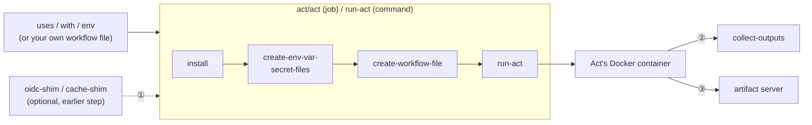
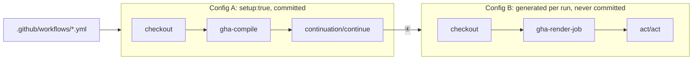

# Act Orb (Unofficial) [](https://circleci.com/gh/CircleCI-Labs/act-orb) [](https://circleci.com/developer/orbs/orb/cci-labs/act) [](https://raw.githubusercontent.com/CircleCI-Labs/act-orb/master/LICENSE) [](https://discuss.circleci.com/c/ecosystem/orbs)

The Act Orb runs a real GitHub Action inside a CircleCI job, using the open-source [Act
CLI](https://nektosact.com/) so `uses:`/`with:`/`env:` behave exactly as they would on GitHub.
Beyond that one-action-per-call core, it can also compile a whole `.github/workflows/*.yml` file
into a wired-together, multi-job CircleCI config -- see the capability table below for the full
surface, or jump straight to the Quick Start.

This orb would not be possible without the contributors who have worked on the [Act
CLI](https://nektosact.com/).

---
**Disclaimer:**

CircleCI Labs, including this repo, is a collection of solutions developed by members of CircleCI's field engineering teams through our engagement with various customer needs.

-   ✅ Created by engineers @ CircleCI
-   ✅ Used by real CircleCI customers
-   ❌ **not** officially supported by CircleCI support

---

## Quick Start

```yaml
version: 2.1
orbs:
  act: circleci/act@x.y.z
workflows:
  main:
    jobs:
      - act/act:
          name: "Hello World Javascript Action"
          uses: actions/hello-world-javascript-action@v1.1
          with: |
            who-to-greet: "Mona the Octocat"
          env: |
            hello-world: "example-value"
```

That's it for the common case -- `act/act` is a full job (checkout, install Act, generate a
one-step workflow file from `uses`/`with`/`env`, run it, cache what's cacheable). Use the `act/act`
**command** instead of the job if you need to run it inside your own executor/job (see
[Examples](#examples)).

## Capabilities

Everything below the surface area a `uses:`/`with:`/`env:` call touches -- what handles it, and
where to read the detail.

| Capability | Command(s) | Detail |
|---|---|---|
| Run one GitHub Action as a step | `act` (job or command) | [Quick Start](#quick-start) above |
| Compile a whole multi-job `.github/workflows/*.yml` | `gha-compile`, `gha-render-job` | [GitHub Actions workflow compiler](#github-actions-workflow-compiler) |
| Cache the Act CLI, its actions dir, and platform images | `cache-cli` / `cache-actions` / `cache-images` | [Caching](#caching) |
| A real `actions/cache@v4` backend (SigV4-signed S3) | `cache-shim` | [Actions cache shim](#actions-cache-shim) |
| A real, CircleCI-signed OIDC token for `core.getIDToken()` | `oidc-shim` | [OIDC token issuance](#oidc-token-issuance-for-wrapped-actions) |
| `actions/upload-artifact`/`download-artifact@v4` | `artifact-server-path` param on `act`/`run-act` | [Artifacts](#artifacts) |
| Surface an action's own outputs to later native steps | `outputs` param on `act`/`run-act` | [Capturing action outputs](#capturing-action-outputs) |
| Pass a GitHub `services:` block straight through | `services` param on `act`/`run-act` | [Service containers](#service-containers) |

## Table of contents

- [Scope: one action per job/command invocation](#scope-one-action-per-jobcommand-invocation)
- [How it fits together](#how-it-fits-together) -- two diagrams and the high-level mental model
- [Mapping GitHub Actions to CircleCI](#mapping-github-actions-to-circleci) -- the concept-by-concept translation, with the *why*
- [Defaults that deviate from Act](#defaults-that-deviate-from-act)
- [Caching](#caching)
- [Actions cache shim](#actions-cache-shim)
- [OIDC token issuance for wrapped Actions](#oidc-token-issuance-for-wrapped-actions)
- [Artifacts](#artifacts)
- [Capturing action outputs](#capturing-action-outputs)
- [Service containers](#service-containers)
- [Security notes](#security-notes)
- [Command and job reference](#command-and-job-reference) -- every command/job, every parameter, and when to reach for the granular commands
- [What does not work](#what-does-not-work) -- the honest limits, including platform-level gaps no orb can shim around
- [GitHub Actions workflow compiler](#github-actions-workflow-compiler)
- [Legal / compliance](#legal--compliance)
- [Resources](#resources)
- [Examples](#examples)
- [How to Contribute](#how-to-contribute)
- [How to Publish An Update](#how-to-publish-an-update)

## Scope: one action per job/command invocation

This orb (like its ecosystem-bridge siblings -- Bitrise, Harness, Bitbucket Pipes, Buildkite)
generates **one job, one step, one action** per `act/act`/`act/run-act` call, by design. It is
not a general GitHub Actions workflow executor for that call: give it a `uses`/`with`/`env`
triple (or your own hand-written workflow file) and it runs exactly that. If you need a
multi-step workflow in one job, hand-write the workflow file and pass it via
`skip-create-workflow-file: true` (see [Examples](#examples)).

**Unlike its siblings, this orb also has a second, larger-scoped escape hatch for the case that
single-action scope doesn't cover:** the [GitHub Actions workflow
compiler](#github-actions-workflow-compiler) compiles a whole, real, multi-job
`.github/workflows/*.yml` file into a wired-together, multi-job CircleCI config -- one CircleCI
job per GitHub job, `needs:` becoming `requires:`, `strategy.matrix` becoming a real CircleCI
`matrix:` job. That feature is deliberately a separate, additive layer on top of the
one-action-per-call core, not a replacement for it: every job the compiler generates still calls
into that same one-action machinery under the hood. See [How it fits
together](#how-it-fits-together) for exactly how the two connect.

## How it fits together

This is the mental model, not the full implementation -- enough to know what generates what, where
a shim attaches, and which CircleCI primitive stands in for which GitHub Actions one. Every arrow
below is real, traced against the commands in `src/commands/`, not aspirational.

There are two ways a GitHub Action reaches this orb, and they converge on the same underlying
`act/act`/`act/run-act` machinery:

- **Path A -- one action as a step.** You give `act/act` (job) or `act/run-act` (command) a
  `uses`/`with`/`env` triple directly, or your own hand-written workflow file. This is the common
  case from the Quick Start above.
- **Path B -- a whole `.github/workflows/*.yml` file.** The [GitHub Actions workflow
  compiler](#github-actions-workflow-compiler) (`act/gha-compile`) turns a real, multi-job workflow
  into a CircleCI config with one job per GitHub job; each generated job then re-derives its own
  single-job slice of the original file (`act/gha-render-job`) and hands it to `act/act` the exact
  same way Path A would, just with the workflow file already supplied instead of generated.

Two diagrams, not one, because they answer different questions: the first is what happens inside
*every single* `act/act`/`act/run-act` call, regardless of who supplied its workflow file; the
second is specifically how Path B produces that workflow file in the first place, across two
separate CircleCI configs.

### The core pipeline

Every `act/act`/`act/run-act` call -- Path A directly, or Path B's generated jobs via
`skip-create-workflow-file: true` -- goes through this same sequence:



1. Via `$BASH_ENV` -- a shim run as an earlier step exports its token/credential, and
   `create-env-var-secret-files` (which snapshots the *entire* job environment) picks it up
   automatically, with zero call-site wiring.
2. `steps.*.outputs.*`, only when `outputs` is set -- resolved inside the container, handed off to
   `collect-outputs`, which exports it into `$BASH_ENV` for a later native CircleCI step.
3. `actions/upload-artifact@v4`, only when `artifact-server-path` is set -- Act's own built-in
   artifact-v4 server; a native `store_artifacts`/`persist_to_workspace` step reads its output.

Reading it:

- **`create-env-var-secret-files` is the seam every shim uses, with zero call-site wiring.** It
  snapshots the *entire* job environment (`env -0`) into the files Act reads from -- so anything an
  earlier step in the same job exported into `$BASH_ENV` (a shim's token, a differently-named
  `github-token` source variable) reaches Act and the wrapped action automatically. This is why
  `act/oidc-shim`/`act/cache-shim` are drawn as steps *before* the `act/act` block, feeding it
  sideways, rather than as something `act/act` itself calls.
- **The two "shim" boxes are the two places this orb hands the wrapped action a credential Act
  itself cannot produce** -- a cloud OIDC token, and a working `actions/cache` backend. Both work
  the same way structurally: a small local HTTP server, started as an earlier step, that speaks the
  real GitHub protocol the wrapped action's own JS toolkit expects, backed by a real CircleCI API
  call. See their own sections below for what's proven end to end and what isn't.

### The compiler's two-config flow

`gha-compile` doesn't replace the core pipeline above -- it produces the inputs to it, once per
generated job, across two separate CircleCI configs:



4. `continuation/continue` hands over Config B -- one CircleCI job per GitHub job, wired with
   `requires:`/`filters:`, `strategy.matrix` -> `matrix:`, `runs-on: self-hosted` ->
   `resource_class`.

Reading it:

- **Config A is the only file you ever commit.** It runs once per pipeline trigger, checks out
  your repo, compiles `WF` (your real `.github/workflows/*.yml`) into Config B, and hands Config B
  to `circleci/continuation`'s `continue` command -- that call is what makes Config B actually run
  as this same pipeline's remaining jobs.
- **Config B is regenerated from scratch every run and never committed anywhere.** It exists only
  as the in-memory string `act/gha-compile` produced and `continuation/continue` submitted.
- **Config B's own jobs don't receive their workflow slice *from* Config A -- they re-derive it.**
  Each generated job checks out the *same* commit's `WF` again and runs `act/gha-render-job`
  itself, at that job's own runtime, to produce just its one job's `needs:`-stripped, output-
  rewritten slice. This is deliberate, not an inefficiency: CircleCI's continuation payload is one
  config file, not an arbitrary bundle of extra files, so re-deriving from the checkout each job
  already has is simpler than smuggling N per-job fragments through the `continue` call.
- **From `act/act` on, a compiler-generated job is indistinguishable from Path A.** Its `act/act`
  call is ordinary `act/act` with `skip-create-workflow-file: true`; nothing downstream of
  `run-act` knows or cares whether the workflow file it's holding was hand-written, generated from
  `uses`/`with`/`env`, or rendered by the compiler -- see the core pipeline diagram above for what
  happens from there.

**Caching (`cache-cli`/`cache-actions`/`cache-images`) and `install`/`install-ghac` are orthogonal
to both diagrams above** -- they speed up "install Act" and "install ghac" on repeat runs, but
don't change what gets generated or how it executes, so they're omitted from both for clarity; see
[Caching](#caching).

## Mapping GitHub Actions to CircleCI

A concept-by-concept translation, with the reasoning behind each mapping -- not just a name-to-name
table. If you already think in GitHub Actions, this is the fastest way to start thinking in
CircleCI without re-deriving it construct by construct.

| GitHub Actions concept | CircleCI concept | Why this mapping, not a different one |
|---|---|---|
| **Workflow** (`.github/workflows/*.yml`) | **Pipeline** (`.circleci/config.yml`, or a `gha-compile`-generated one) | Both are the top-level "what runs, in what order, on what trigger" document for one repo. The compiler treats a GH workflow file as the *source* it compiles from, not something it re-implements as a runtime concept -- CircleCI's own pipeline is the thing that actually executes. |
| **Job** | **Job** | A like-for-like unit of one machine/container running a sequence of steps to completion. This is the one mapping with no conceptual translation at all -- it's why the compiler can go one-GH-job-to-one-CircleCI-job rather than needing to fan jobs out or merge them. |
| **`needs:`** | **`requires:`** | Both express "don't start until these upstream jobs have succeeded." Direct translation; the compiler emits `requires:` naming the same job IDs (expanded to also include any `strategy.matrix.include`-added job invocations -- see the compiler table below). |
| **`strategy.matrix`** | **`matrix:`** (job invocation, not the job definition) | GitHub expands a matrix into N runs of the *same job spec*; CircleCI does the same thing but as a property of *invoking* an existing parameterized job, not of the job itself. The compiler turns each matrix key into a CircleCI job parameter and calls the (now-parameterized) job once via a `matrix:` block, rather than generating N static job copies -- this is a real CircleCI `matrix:` job invocation, verified against the real CLI, not a compiler-side unrolling trick. |
| **`runs-on:`** | **Executor** (`machine:`, `docker:`, or a self-hosted runner's `resource_class:`) | GitHub's `runs-on:` picks a *managed VM image*; CircleCI's executor picks a *machine shape*. For anything Act can actually emulate (`ubuntu-*`), this compiles to the `machine:` executor + an `act --platform` image -- see [Defaults that deviate from Act](#defaults-that-deviate-from-act) for why `machine`, not `docker:`, is this orb's own default. `runs-on: self-hosted` maps to a real CircleCI self-hosted runner `resource_class:` instead of an executor -- see the compiler table for the exact naming convention. |
| **Step** | **Step** | Also a direct, like-for-like mapping -- a step is a step. The interesting translation isn't the container concept, it's what a *specific kind* of step (`uses:`) becomes; see the next row. |
| **`uses:` (an action)** | **One `act/act` invocation, wrapping one `run:` step** | GitHub's own runner has native, first-class support for "resolve and execute this action." CircleCI's `run:` step is a shell command -- there's no native "run a GitHub Action" primitive to map onto, so this orb builds one: it generates a one-step GitHub workflow file naming just that action, then runs it for real, inside Act's own container, via a `run:` step that invokes the `act` CLI. The action's own logic is never reimplemented or approximated -- Act executes the real, unmodified action, in its own real (or emulated) runtime; this orb's job stops at getting Act invoked correctly. |
| **`GITHUB_OUTPUT`** (the file an action or `run:` step writes `key=value` lines to) | **`$BASH_ENV`** | GitHub's runner watches a well-known file path and threads its contents into `steps.<id>.outputs.*` for the rest of the *workflow run* to reference via expressions. CircleCI has no equivalent expression-evaluation layer over step outputs -- `$BASH_ENV` is CircleCI's own mechanism for "a value computed in one step should be visible as a shell variable in later steps of the *same job*." This orb's `outputs`/`collect-outputs` bridges the two: it lets Act's own expression evaluation (`${{ steps.<id>.outputs.<key> }}`) resolve the value inside the container, writes it to a handoff file, then a later step exports it into `$BASH_ENV` for the rest of the CircleCI job. See [Capturing action outputs](#capturing-action-outputs) for the full mechanism and its two documented failure modes. |
| **`needs.<job>.outputs.<name>`** (cross-*job* output) | **Workspace** (`persist_to_workspace`/`attach_workspace`) plus an `env` rewrite | `$BASH_ENV` only reaches later steps in the *same* job; crossing a job boundary on CircleCI means moving a file through the workspace, the platform's own cross-job data-passing primitive. The compiler captures the named output into a small file, persists it to the workspace from the producing job, attaches it in every job that referenced it, and rewrites the `${{ needs.<job>.outputs.<name> }}` expression (the exact whole expression, not a fragment) to `${{ env.* }}` sourced from that file. This is why the compiler table below draws a hard line at *combining* `needs.*` with other operators or a function call: the rewrite is textual and exact, not a real expression evaluator. |
| **`core.getIDToken()` / OIDC** | **`act/oidc-shim`**, backed by CircleCI's own native OIDC issuer | Not a mapping onto an existing CircleCI primitive so much as a bridge to one: CircleCI already has its own OIDC token issuance (`circleci run oidc get`, and the always-injected `CIRCLE_OIDC_TOKEN`/`CIRCLE_OIDC_TOKEN_V2`) for exactly this cloud-role-assumption use case -- it's just shaped, claimed, and requested differently than GitHub's. `act/oidc-shim` answers the wrapped action's own GitHub-shaped OIDC request contract with a real, CircleCI-signed token; see [OIDC token issuance for wrapped Actions](#oidc-token-issuance-for-wrapped-actions) for why the token identifies CircleCI, not GitHub, and what that means for your cloud role's trust policy. |
| **`actions/cache@v4`** | **`act/cache-shim`**, backed by CircleCI's runner API + S3 | Same shape of bridge as OIDC: CircleCI's runner API has its own cache-save/cache-restore endpoints; this orb speaks GitHub's real cache-service-v2 wire protocol on one side and CircleCI's runner API (plus a real, SigV4-signed S3 upload/download leg) on the other. See [Actions cache shim](#actions-cache-shim) for the full contract and the cross-job durable-hit proof. |
| **`actions/upload-artifact`/`download-artifact`** | **`store_artifacts`**, via Act's own built-in artifact server | CircleCI's artifact concept (files attached to a job, browsable after the fact) is close enough to GitHub's that no protocol bridge was needed here -- Act already ships a complete, working implementation of GitHub's real artifact-v4 protocol; this orb only had to expose the flag that turns it on and point a native `store_artifacts` step at the same directory. See [Artifacts](#artifacts). |

## Defaults that deviate from Act

This orb intentionally overrides six of Act's own CLI defaults, tuned for CircleCI's
fresh-VM/container-per-job model rather than Act's own local-developer-loop assumptions. All six
are `additional-act-flags`-overridable and every one is a real, current default -- not a defect --
but they were previously undocumented, so a user reading only Act's own docs would be surprised:

| Flag | Act's own CLI default | This orb's default | Why |
|---|---|---|---|
| `--pull` | `true` | `false` | Avoid re-pulling the platform image on every single job when it was likely already pulled/cached this run. |
| `--rebuild` | `true` | `false` | Same reasoning as `--pull`. |
| `--reuse` | `false` | `true` | Keep container state across the (single) job invocation. |
| `--bind` | `false` | `true` | Share the checkout directory bidirectionally with Act's container rather than copying it -- also required for the `outputs` feature below. |
| `--detect-event` | `false` | `true` | The generated workflow always has exactly one event; auto-detecting it avoids an extra required parameter. |
| `--action-offline-mode` | `false` | `true` | Paired with this orb's own actions cache (`cache-actions`), which is expected to already hold what a prior run fetched. |

Override any of these via the matching orb parameter (`pull`, `rebuild`, `reuse`, `bind`,
`detect-event`, `action-offline-mode`) if your workflow needs Act's own default instead.

This table describes the `act`/`jobs/act` entry points, which pass all six explicitly. If you call
the lower-level `act/run-act` **command** directly (see the Quick Start note above on when to use
it), `pull` and `rebuild` fall back to Act's own default (`true`) rather than this table's `false`
when you don't set them -- `run-act` is a published command in its own right, so its standalone
default is kept stable rather than silently changed underneath any existing direct caller.

## Caching

This orb caches three independent things, each on and off separately, because each is a genuinely
different artifact with a different cost/benefit tradeoff:

| Dimension | Parameter | Default | What's cached | Cache key |
|---|---|---|---|---|
| The `act` CLI binary itself | `cache-cli` | on | `<bin-dir>/act` | arch + resolved Act version (`"latest"` is resolved to a concrete tag via the GitHub API before being used as a key, so a `"latest"` pin still gets fresh cache hits/misses as new versions ship, rather than sticking to whatever "latest" meant on the first run) |
| Act's downloaded-actions directory | `cache-actions` | on | `~/.cache/act` (the actions/dependencies Act itself fetched) | arch + `cache-key-prefix` + CircleCI project ID + job name |
| The platform Docker image | `cache-images` | **off** | a `docker save`'d tar of the platform image (see `platform`) | arch + `platform` + `cache-key-prefix` |

`cache-images` defaults to off because Docker image tars are large relative to the other two
artifacts and remote-docker/executor image pulls are often already fast on CircleCI's own image
cache -- turn it on if your platform image is unusually large or slow to pull in your environment.

All three cache keys share the `cache-key-prefix` parameter (default `v1`) as a common prefix, so
bumping it busts every cache dimension at once if you ever need a clean slate across all of them.

**Upgrade note:** the `cache-actions` key format changed in this release (a stray double dash
before `{{ .Environment.CIRCLE_JOB }}` was fixed to a single dash). Cache keys are literal
strings, not patterns, so this is a one-time, self-healing change: your existing actions cache
under the old key becomes unreachable, `restore_cache` falls through to the unversioned prefix key
(or a cold cache on the very next run), and a fresh cache is saved under the corrected key from
then on. Nothing breaks -- expect one slower "Restoring cache for Act's Actions..." step after
upgrading, not a caching regression.

## Actions cache shim

`act/cache-shim` translates GitHub's Actions-cache-service-v2 protocol -- what `actions/cache@v4`
(and every `setup-*` action with built-in caching) actually speaks -- into calls against
CircleCI's own runner API, so the wrapped action's cache calls hit a real server instead of
Act's own ephemeral, local-disk-only cache. It is a real, ~650-line protocol implementation
(`src/scripts/cache_shim_server.py`), not a stub, and it is exercised for real in this orb's own
CI against the live CircleCI runner API **and real AWS S3** on every pipeline run.

**Be precise about what that proves.** The RPC negotiation, auth enforcement, block-blob
chunked-upload reassembly, and the upload/download leg itself are all proven -- locally
(`test/cache-shim/run_tests.py`, 23/23 passing against a fake backend that models the full
contract, including a fake S3 the shim's real signer PUTs/GETs against) and against the real,
live CircleCI API and S3. A **durable, cross-job cache hit** is proven too, not just a same-job
save+restore: `test_cache_shim_durable_hit_save`/`test_cache_shim_durable_hit_restore` in
`.circleci/test-deploy.yml` are two *separate* jobs -- separate machine, separate `act/cache-shim`
process, separate STS credentials fetched fresh for the restore leg -- where the second job
`requires:` the first and asserts a byte-for-byte diff against the original file.

### Quick start

```yaml
version: 2.1
orbs:
  act: circleci/act@x.y.z

jobs:
  build_with_cache:
    docker:
      - image: cimg/base:current
    steps:
      - checkout
      - setup_remote_docker
      - act/cache-shim
      - act/act:
          uses: actions/cache/save@v4
          with: |
            path: node_modules
            key: my-cache-key-v1
workflows:
  main:
    jobs:
      - build_with_cache
```

`act/cache-shim` must run in an earlier step of the **same job**, before `act/act`/`run-act`, for
the same reason `act/oidc-shim` does: it exports `ACTIONS_CACHE_SERVICE_V2`/`ACTIONS_RESULTS_URL`/
`ACTIONS_RUNTIME_TOKEN` into `$BASH_ENV`, which `act/act`'s own `create-env-var-secret-files` step
picks up automatically with zero call-site wiring -- the same seam the `github-token` parameter
and `act/oidc-shim` already use. It deliberately does **not** also export `GITHUB_SERVER_URL`:
an earlier version of this shim did (matching the naive reading of `actions/cache`'s own
`isGhes()` check, which treats a `*.localhost` hostname as "not GHES"), and that broke real jobs
outright -- Act's own action-resolution logic reads `GITHUB_SERVER_URL` from the exact same job
shell (since `$BASH_ENV` affects every later step, not just the wrapped action's container) to
decide where to `git clone` the wrapped action *from*, so a fake `*.localhost` value made Act try
to clone `actions/cache` itself from that fake host and fail immediately (measured live: `dial
tcp: lookup cache-shim.localhost: no such host`). Leaving the variable unset costs nothing:
`actions/cache`'s own `isGhes()` already defaults to `https://github.com` (i.e. "not GHES") when
it's absent.

### Protocol, evidence, and security detail

The exact Twirp RPC sequence, the Azure block-blob chunked-upload reassembly (including the
out-of-order-block and no-`comp`-single-PUT cases a naive implementation gets wrong), and the real
SigV4-signed S3 upload/download contract -- plus how an earlier version's "known gap" (reading
`location` as a route on `runner_host` itself, which 404'd) was diagnosed and fixed -- are
documented in full, with sources, in [`docs/CACHE-SHIM.md`](docs/CACHE-SHIM.md).

**Security, in brief:** binds `0.0.0.0` deliberately, because Act's spawned action container is a
network-namespace sibling of whatever process starts this shim, not loopback-reachable from it.
The real auth boundary is a per-job token (`secrets.token_urlsafe(32)`, checked constant-time),
carried both as a Twirp bearer header and as a `token=` query parameter on the upload/download
proxy URLs -- real Azure block-blob PUTs and `actions/cache`'s plain-GET downloads send no bearer
header, so the query param is what actually gates those endpoints. This shim's own AWS STS
credentials never leave the process (no response body, log line, or `$BASH_ENV`). Full reasoning:
[`docs/CACHE-SHIM.md`](docs/CACHE-SHIM.md#security-notes).

## OIDC token issuance for wrapped Actions

`act/oidc-shim` lets a wrapped GitHub Action call `core.getIDToken()` (directly, or through a
higher-level action like `aws-actions/configure-aws-credentials`) and receive a real,
CircleCI-signed OpenID Connect token, instead of erroring outright. Act itself implements none of
GitHub's own OIDC token issuance
([nektos/act#2500](https://github.com/nektos/act/issues/2500),
[nektos/act#2262](https://github.com/nektos/act/issues/2262), both open) -- this shim doesn't
patch Act, it answers the wrapped action's request directly, the same structural pattern
`act/cache-shim` uses: a small local HTTP server, started as an earlier step, speaking the real
protocol the action's own JS toolkit expects.

**Be precise about what this does and does not change.** The token this shim hands back is real
and CircleCI-signed -- `circleci run oidc get` really mints it -- but it identifies **CircleCI**
as the issuer, not GitHub. A cloud role's trust policy has to be told to trust CircleCI's issuer
and claim shape before it will accept this token; that is a one-time change you make on the cloud
side (see below), not something this shim can paper over.

### Quick start

```yaml
version: 2.1
orbs:
  act: circleci/act@x.y.z

jobs:
  assume_aws_role_from_action:
    docker:
      - image: cimg/base:current
    steps:
      - setup_remote_docker
      - act/oidc-shim:
          audience-allowlist: "sts.amazonaws.com"
      - act/act:
          uses: aws-actions/configure-aws-credentials@v4
          with: |
            role-to-assume: arn:aws:iam::123456789012:role/gha-bridge-example
            aws-region: us-east-1
      - run:
          name: Use the assumed role natively
          command: aws sts get-caller-identity
workflows:
  main:
    jobs:
      - assume_aws_role_from_action
```

`act/oidc-shim` must run in an earlier step of the **same job**, before `act/act`/`run-act`, for
the identical reason `act/cache-shim` does: it exports
`ACTIONS_ID_TOKEN_REQUEST_URL`/`ACTIONS_ID_TOKEN_REQUEST_TOKEN` into `$BASH_ENV`, which
`create-env-var-secret-files` picks up automatically with zero call-site wiring -- the same seam
the `github-token` parameter and `act/cache-shim` already use (see [How it fits
together](#how-it-fits-together)).

### The one-time cloud-side setup

This is the real prerequisite, and it lives entirely on the cloud provider's side, not this
orb's -- no orb-side flag substitutes for it:

1. **Register CircleCI as an OIDC identity provider.** For AWS: an IAM OIDC provider for
   `https://oidc.circleci.com/org/<your-org-id>`, with audience `sts.amazonaws.com` (or whatever
   audience your action requests). CircleCI's own [OIDC token
   docs](https://circleci.com/docs/openid-connect-tokens/) cover the exact provider URL and claim
   shape for AWS, GCP, Azure, and Vault.
2. **Point the role's trust policy at CircleCI's claims, not GitHub's.** The token this shim
   hands back has CircleCI's own claim shape (org/project/context, not
   `repo:owner/repo:ref:refs/heads/main` the way GitHub's would) -- a trust policy copied verbatim
   from a GitHub Actions OIDC setup guide will reject this token. Scope the trust policy to your
   actual CircleCI org/project the same way you would have scoped it to a specific GitHub
   repo/branch.
3. **Set `audience-allowlist`** on `act/oidc-shim` to the audience your cloud provider expects
   (`sts.amazonaws.com` for AWS). This is defense in depth, not the real security boundary -- but
   it does mean a misconfigured or malicious caller in the same job can't mint a token for an
   audience you never intended to hand out.

None of this is new CircleCI capability invented for this shim -- `circleci run oidc get` and the
always-injected `CIRCLE_OIDC_TOKEN`/`CIRCLE_OIDC_TOKEN_V2` env vars already exist for exactly this
cloud-role-assumption use case. This shim's only job is answering the wrapped action's
GitHub-shaped *request contract* (a GET against `ACTIONS_ID_TOKEN_REQUEST_URL` with an
`audience` query param and a bearer token, reading back `{"value": "<jwt>"}` -- verified directly
against `actions/toolkit`'s `oidc-utils.ts` source, not guessed) with that real token.

### Evidence and security detail

`test_oidc_shim` in `.circleci/test-deploy.yml` proves the shim's real request/response contract,
its auth-gate rejection of missing/wrong bearer tokens, and a real mint through `circleci run oidc
get`, in this orb's own live CI, the same way `test_cache_shim` does for `act/cache-shim`. What it
doesn't yet prove is a full `act/act` run of a wrapped Action actually consuming the token inside
Act's container. The complete evidence trail and the shim's security model (binds `0.0.0.0`
deliberately, per-job constant-time-checked token as the real auth boundary, `audience-allowlist`
as defense in depth only) are documented in [`docs/OIDC-SHIM.md`](docs/OIDC-SHIM.md).

## Artifacts

`actions/upload-artifact`/`download-artifact@v4` now work for jobs that don't use `container:` --
via a much smaller change than a from-scratch shim would have been. Investigating this surfaced
that **Act already ships a complete, working implementation of GitHub's real artifact-v4
protocol** (`pkg/artifacts` in `nektos/act`'s own source: the exact Twirp
`ArtifactService.{CreateArtifact,UploadArtifact,FinalizeArtifact,ListArtifacts,
GetSignedArtifactURL,DownloadArtifact}` routes, storing to local disk) -- it just never starts
that server unless you pass `--artifact-server-path`, a flag this orb never exposed. `run-act`
now has `artifact-server-path`/`artifact-server-addr`/`artifact-server-port` parameters (all
empty/off by default -- zero behavior change unless you set them) that pass straight through to
Act's own CLI flags of the same name. Once Act's runner sees `ArtifactServerPath != ""`, it
automatically injects `ACTIONS_RUNTIME_URL`/`ACTIONS_RESULTS_URL`/`ACTIONS_RUNTIME_TOKEN` into the
wrapped action's container itself (verified directly in `pkg/runner/run_context.go`) -- no orb
wiring needed beyond the one flag.

```yaml
- act/act:
    uses: actions/upload-artifact@v4
    with: |
      name: my-artifact
      path: some-file.txt
    artifact-server-path: /tmp/act-artifacts
- store_artifacts:
    path: /tmp/act-artifacts
    destination: gha-artifacts
```

This is real, tested in this orb's own CI (`test_artifacts` in `.circleci/test-deploy.yml`) end to
end: the file really lands on the CircleCI host's disk at the configured path, handed to a native
`store_artifacts` step. It does **not** fix `upload-artifact@v4` failing outright inside
`container:`-scoped jobs ([nektos/act#2508](https://github.com/nektos/act/issues/2508), open,
because the job's container image has no Node in it) -- that is an upstream Act limitation no
orb-side flag can work around, exactly as anticipated when this was originally scoped as deferred
(see `docs/ROADMAP.md` item 2).

## Capturing action outputs

Set `outputs` to a comma-separated list of the wrapped action's own output keys (matching its
`action.yml` `outputs:` block) to have this orb export them, verbatim by name, into `$BASH_ENV`
for a later, native CircleCI step in the same job to read as a plain shell variable:

```yaml
- act/act:
    uses: actions/hello-world-javascript-action@v1.1
    with: |
      who-to-greet: "Mona the Octocat"
    outputs: "time"
- run: echo "Greeted at $time"
```

This is opt-in and defaults to off (`outputs: ""`) -- existing jobs that don't set it see no
behavior change at all. It works by giving the generated action step a stable `id:` and appending
a second, same-job step that resolves each `${{ steps.<id>.outputs.<key> }}` expression and writes
it to a handoff file inside the (bound) checkout directory, which a `collect-outputs` step then
reads back on the CircleCI host. It does **not** read Act's `$GITHUB_OUTPUT` file directly --
that file lives inside Act's own per-step temp area, which is not shared with the CircleCI host
even with `bind` enabled, so `steps.*.outputs` expression evaluation (which Act supports natively)
is the mechanism that actually works. This means `outputs` only works when this orb is generating
the workflow file (`skip-create-workflow-file` unset) and `bind` stays enabled (the default). If
you bring your own workflow file, you can still reach `$BASH_ENV` yourself using the same pattern
this orb generates.

Violating either requirement does not error -- it fails silently, so know the actual behavior:

- **`bind: false` with `outputs` set:** the container's handoff-file write never reaches the
  CircleCI host, so `collect-outputs` finds nothing and no-ops. This orb logs a warning to that
  effect; no output is exported and no later step's use of the variable will resolve.
- **`skip-create-workflow-file: true` with `outputs` set:** nothing generates the output-capture
  step in your hand-written workflow, so Act never (re)writes the handoff file on this call. Every
  `act/act`/`run-act` invocation that requests `outputs` removes any handoff file left over from
  an *earlier* call in the same job/`directory` before it runs, specifically so this case can never
  silently re-export a previous call's stale value -- but it still cannot produce a *fresh* value
  from a workflow file that doesn't write one, since Act's own `$GITHUB_OUTPUT` per-step temp area
  isn't shared with the host even with `bind` on. Add the same "collect outputs for CircleCI" step
  this orb generates (see the source of `create-workflow-file.sh`) to your own workflow file if you
  need `outputs` alongside `skip-create-workflow-file`.

Output keys containing characters that aren't legal in a shell variable name (GitHub allows `-` in
output ids; bash does not) are exported under a sanitized name (dashes -> underscores) with a
loud warning in the step's log -- the action's own output name is unaffected, only the
CircleCI-side variable name differs.

## Service containers

Pass a GitHub Actions `services:` block straight through via the `services` parameter:

```yaml
- act/act:
    uses: actions/hello-world-javascript-action@v1.1
    services: |
      postgres:
        image: postgres:16
        env:
          POSTGRES_PASSWORD: postgres
        ports:
          - 5432:5432
```

This is a **verbatim passthrough** into the generated workflow file -- Act emulates `services:`
itself via its own Docker networking, which inherits Act's own known service-emulation issues
([nektos/act#1022](https://github.com/nektos/act/issues/1022),
[nektos/act#2607](https://github.com/nektos/act/issues/2607), both open at the time of writing).
A native translation to a CircleCI secondary Docker image (CircleCI's own equivalent primitive,
no Act emulation needed) is a larger, job-level design change -- see `docs/ROADMAP.md`.

## Security notes

**`with`/`env`/`services` are trusted, unescaped input.** This orb builds the generated workflow
file by embedding these parameters' raw string values directly into generated YAML (indented to
fit, but not otherwise escaped). This matches how `config.yml` itself already trusts a job's own
parameter values, but it's worth stating plainly now that `services` extends the same pattern to
a third parameter: if any of `with`/`env`/`services` are ever populated from a source you don't
control (e.g. a CircleCI pipeline parameter fed by a webhook payload or a PR title), a crafted
value could break out of its intended YAML block and inject arbitrary keys/steps into the
generated workflow. Treat these the same as any other config-author-trusted value -- don't wire
untrusted external input into them directly.

**`GITHUB_TOKEN` is a weaker substitute, not a drop-in one.** Real GitHub Actions' `GITHUB_TOKEN`
is a per-job GitHub App installation token, auto-scoped to exactly one repository and
auto-expiring when the job ends. There is no CircleCI primitive that mints anything like it. This
orb (and its `avoid_token_error` example) can only wire in a personal access token you create and
store as a CircleCI project/context env var -- which is broader in scope than the job needs, does
not auto-expire, is not automatically narrowed by a workflow's own `permissions:` block, and must
be rotated by you. Scope it to the minimum you actually need and rotate it on a schedule.

**The `github-token` parameter is a seam, not a mint.** By default it names `GITHUB_TOKEN` --
identical behavior to today. Point it at a *different* CircleCI env var name (e.g. one populated by
a future pipeline-scoped token-minting step) and this orb aliases that variable's value into the
secrets bucket under the literal key `GITHUB_TOKEN` for you, and keeps the source variable's own
name out of the plaintext `.env` file automatically -- so Act and the wrapped Action still see a
plain `GITHUB_TOKEN`, with zero interface change on either side. This orb implements only the
aliasing; it mints nothing itself. CircleCI's Sources of Change team already mints scoped GitHub
App installation tokens tied to pipeline-trigger time (`TokenRestrictions{Scopes, RepositoryIDs}`,
`CreateAndStoreTokenForPipeline` in `soc-integrations`) -- the only missing piece to get much
closer to real GitHub Actions' own per-job token behavior is exposing one of those into a job's
environment under some other env var name and pointing `github-token` at it. See
`docs/ROADMAP.md` for the fuller rationale.

**The env/secret/var files this orb generates for Act are opt-in secret, not opt-out.** By
default only `GITHUB_TOKEN` is treated as sensitive (the `secrets` parameter); every other
environment variable present in the job is written to the **plaintext** `.env` file Act reads
from, unless you explicitly list it in `secrets` or `variables`. Review what your job's
environment actually contains before running this orb, especially in a context with broad env
access. Multi-line values (SSH keys, JSON service-account credentials) are handled without
leaking fragments into the plaintext file even when correctly named as a secret, but are still
written unquoted -- Act's own dotenv-style parser may not round-trip an embedded newline
correctly; avoid multi-line secrets/vars, or pre-encode them (e.g. base64), if you must use one.

**Act's own installer script is fetched from a pinned commit and checksum-verified before it's
ever executed** (rather than piping a mutable branch ref straight into `sudo bash`) -- see the
comment block at the top of `src/scripts/install.sh` for the maintenance process if Act changes
that script upstream. The release *binary* Act's installer downloads is checksum-verified by
Act's own installer already; this orb doesn't duplicate that, only the installer-script fetch
itself.

## Command and job reference

Every command and job this orb ships, one line each. "Calls" means the aggregate composes that
command internally with no extra wiring at your call site -- see [Reach for the granular
commands instead](#reach-for-the-granular-commands-instead-of-act-when) below for when to call
one of these directly instead of the aggregate.

| Name | Kind | What it does |
|---|---|---|
| `act` | command, job | The aggregate most users want (see [Quick Start](#quick-start)): checkout -> install -> create-env-var-secret-files -> create-workflow-file -> run-act, in order. The job also picks the executor; the command runs inside whatever job/executor you already have. |
| `install` | command | Resolves and installs the Act CLI. Calls `restore-cli`/`cache-cli` itself when `cache-cli` is true (the default). |
| `restore-cli` | command | Restores the cached Act binary (arch + resolved version key -- `"latest"` is resolved to a concrete tag first, see [Caching](#caching)). |
| `cache-cli` | command | Saves the Act binary to cache after a successful install. |
| `create-env-var-secret-files` | command | Snapshots the job's entire environment (`env -0`) into `.env`/`.secrets`/`.vars`, splitting by the `secrets`/`variables` allow-lists and the `github-token` seam. This is the seam every shim (`oidc-shim`, `cache-shim`) rides for free -- see [How it fits together](#how-it-fits-together). |
| `create-workflow-file` | command | Generates a one-action GitHub workflow YAML file from `uses`/`with`/`env`/`services`/`outputs`. Skipped entirely when you supply your own workflow file (`skip-create-workflow-file: true`). Its own parameter is named `action`, not `uses` -- `act`/`act` (job/command) map `uses` onto it for you. |
| `run-act` | command | Restores/saves the actions and Docker-image caches (`restore-actions`/`restore-image` before, `cache-actions`/`cache-image` after) around the actual `act` CLI invocation, then runs `collect-outputs` if `outputs` is set. The lowest-level command that actually invokes `act` -- see the Quick Start's note on when to call this instead of `act`. |
| `restore-actions` | command | Restores Act's downloaded-actions cache (`~/.cache/act`). |
| `cache-actions` | command | Saves Act's downloaded-actions cache after a run. |
| `restore-image` | command | Restores a cached, `docker save`'d platform image tar (only meaningful with `cache-images: true`). |
| `cache-image` | command | Saves the platform image tar to cache after a run (only meaningful with `cache-images: true`). |
| `collect-outputs` | command | Reads the action-output handoff file `run-act` produced and exports each value, verbatim by key name, into `$BASH_ENV`. Safe to call even if nothing was produced -- see [Capturing action outputs](#capturing-action-outputs). |
| `oidc-shim` | command | Starts the local OIDC-token shim (see [OIDC token issuance for wrapped Actions](#oidc-token-issuance-for-wrapped-actions)). Run before `act`/`run-act` in the same job. |
| `cache-shim` | command | Starts the local Actions-cache-protocol shim (see [Actions cache shim](#actions-cache-shim)). Run before `act`/`run-act` in the same job. |
| `install-ghac` | command | Installs `ghac`, the GitHub Actions workflow compiler binary, via a pinned-commit, checksum-verified fetch. A building block for `gha-compile`/`gha-render-job` below -- most callers should use those directly. |
| `gha-compile` | command | Compiles a whole `.github/workflows/*.yml` file into a CircleCI config (one job per GitHub job). Intended for the one job in a `setup: true` pipeline, feeding `circleci/continuation`'s `continue` -- see [GitHub Actions workflow compiler](#github-actions-workflow-compiler). |
| `gha-render-job` | command | Re-derives one GitHub job's single-job, `needs:`-stripped workflow file. Run inside each job a `gha-compile`-generated config produces, immediately before `act` with `skip-create-workflow-file: true`. |

### `act` (command and job) parameters

The full parameter surface -- every one of these is also exposed, under the same name, on the
granular commands that actually consume it (`install`, `create-env-var-secret-files`,
`create-workflow-file`, `run-act`); see each command's own description on the [Orb Registry
page](https://circleci.com/developer/orbs/orb/cci-labs/act) for the always-current, exhaustive
list if this table and that page ever drift.

| Parameter | Type | Default | What it does |
|---|---|---|---|
| `executor` *(job only)* | executor | `default` | Which executor runs Act -- see [Defaults that deviate from Act](#defaults-that-deviate-from-act) for why `machine`, not `docker`, is this orb's own default shape. |
| `checkout` | boolean | `true` | Check out the project first. |
| `uses` | string | `""` | The action to run (e.g. `actions/checkout@v2`). Alias of `id`; `uses` wins if both are set. |
| `id` | string | `""` | Family-consistent alias of `uses` (matches the sibling ecosystem-bridge orbs' vocabulary). |
| `with` | string | `""` | Key-value `with:` block for the action. Alias of `inputs`; `with` wins if both are set. |
| `inputs` | string | `""` | Family-consistent alias of `with`. |
| `env` | string | `""` | Key-value `env:` block for the action's step. |
| `services` | string | `""` | Verbatim `services:` block, passed straight through to Act with no translation -- see [Service containers](#service-containers). |
| `outputs` | string | `""` | Comma-separated action output keys to surface into `$BASH_ENV` -- see [Capturing action outputs](#capturing-action-outputs). Empty (default): zero behavior change. |
| `outputs-file` | string | `.act-orb-outputs.env` | Handoff filename (relative to checkout root) used to carry outputs out of Act's container. |
| `workflow-file` | string | `/tmp/workflow.yml` | Where the generated (or your own) workflow file lives. |
| `skip-create-workflow-file` | boolean | `false` | Skip generation -- use your own workflow file at `workflow-file` instead (see [`passing_workflow_file.yml`](src/examples/passing_workflow_file.yml)). |
| `workflow-name` / `workflow-event` / `job-name` / `runs-on-image` | string | `circleci` / `push` / `action` / `ubuntu-latest` | Cosmetic fields of the generated one-job workflow file. |
| `platform` | string | `ubuntu-latest=catthehacker/ubuntu:act-latest` | Act's `--platform` mapping (`runs-on:` value=image). |
| `github-token` | env_var_name | `GITHUB_TOKEN` | Which CircleCI env var names the GitHub token Act/the action should see -- a seam, not a mint; see [Security notes](#security-notes). |
| `secrets` | string | `GITHUB_TOKEN` | Comma-separated env vars written to the secrets bucket, not the plaintext `.env` file. |
| `variables` | string | `""` | Comma-separated env vars exposed to the action as `${{ vars.* }}`. |
| `env-file` / `secret-file` / `var-file` / `event-file` / `input-file` | string | `/tmp/act.env` / `/tmp/act.secrets` / `/tmp/act.vars` / `/tmp/act.event` / `.input` | Paths to the generated env/secret/var/event/input files Act reads. |
| `actor` | string | `nektos/act` | User that triggered the simulated event. |
| `bind` | boolean | `true` | Bind-mount (not copy) the working directory into Act's container. **Deviates from Act's own default (`false`)** -- see [Defaults that deviate from Act](#defaults-that-deviate-from-act). Required for `outputs`. |
| `verbose` | boolean | `false` | Detailed Act logging. |
| `detect-event` | boolean | `true` | Auto-detect the workflow's event type. **Deviates from Act's own default (`false`).** |
| `directory` | string | `.` | Working directory for the workflow. |
| `action-offline-mode` | boolean | `true` | Run without fetching actions from remote sources (pairs with `cache-actions`). **Deviates from Act's own default (`false`).** |
| `defaultbranch` | string | `main` | Default branch Act assumes. |
| `job` | string | `""` | Run only this job ID from the workflow file. |
| `pull` | boolean | `false` (`true` on `run-act` standalone) | Force-pull Docker images. **Deviates from Act's own default (`true`)** at the `act`/job layer only -- see the table in [Defaults that deviate from Act](#defaults-that-deviate-from-act). |
| `rebuild` | boolean | `false` (`true` on `run-act` standalone) | Rebuild local Docker images. Same deviation pattern as `pull`. |
| `remote-name` | string | `origin` | Git remote name used to resolve the repo URL. |
| `reuse` | boolean | `true` | Don't remove the container after a successful run. **Deviates from Act's own default (`false`).** |
| `additional-act-flags` | string | `""` | Extra flags passed verbatim to the `act` CLI (word-split, unlike every other parameter here). |
| `artifact-server-path` / `artifact-server-addr` / `artifact-server-port` | string | `""` / `""` / `""` | Turn on and configure Act's own built-in artifact-v4 server -- see [Artifacts](#artifacts). Empty is a no-op. |
| `cache-cli` / `cache-actions` / `cache-images` | boolean | `true` / `true` / `false` | Per-dimension cache toggles -- see [Caching](#caching). |
| `cache-key-prefix` | string | `v1` | Common prefix across all three cache-key dimensions. |
| `force-install` | boolean | `false` | Reinstall Act even if a cached/existing binary is present. |
| `version` | string | `latest` | Act CLI version to install. |
| `debug` | boolean | `false` | Debug logging for the install step itself. |
| `bin-dir` | string | `/home/circleci/bin` | Where the Act binary is installed. |
| `skip-install` | boolean | `false` | Skip installing Act entirely (assume it's already on `PATH`). |
| `skip-create-env-var-secret-files` | boolean | `false` | Skip generating the env/secret/var files. |
| `step-name` *(command only)* | string | `Run Act` | Name of the step that actually invokes `act`. Not exposed on the `act` job. |

### `cache-shim` parameters

| Parameter | Type | Default | What it does |
|---|---|---|---|
| `enabled` | boolean | `true` | Kill switch -- `false` starts no server and exports no env vars, so it can be toggled via a pipeline parameter without removing the step. |
| `port` | integer | `8991` | TCP port the shim listens on. Change only if it collides with something else in the same job (e.g. `oidc-shim`'s own `8990`). |
| `bind-host` | string | `0.0.0.0` | Socket bind address, deliberately not loopback-only -- see [Security notes](#actions-cache-shim) above. |
| `advertise-host` | string | `auto` | Address written into `ACTIONS_RESULTS_URL`. `auto` detects the Docker bridge gateway, then the job's own container bridge IP under `setup_remote_docker`, then a last-resort host IP with a warning. |
| `task-socket` | string | `/tmp/circleci-ts.sock` | CircleCI's task-token unix socket, read once at startup for the bearer token and `runner_host`. Missing socket is a fatal, clearly-messaged error. |
| `startup-timeout` | integer | `10` | Max seconds to wait for the shim to report healthy before failing the step. |
| `runner-timeout` | integer | `30` | Max seconds per call to CircleCI's cache-save/cache-restore API before giving up on that request. |
| `state-dir` | string | `/tmp/.cache-shim` | Directory for the generated server script, its log, and its pidfile. |
| `step-name` | string | `Start Actions cache shim` | Name of the step that starts the shim. |

### `oidc-shim` parameters

| Parameter | Type | Default | What it does |
|---|---|---|---|
| `enabled` | boolean | `true` | Kill switch -- `false` starts no server and exports no env vars. |
| `port` | integer | `8990` | TCP port the shim listens on. Change only if it collides with something else in the same job. |
| `bind-host` | string | `0.0.0.0` | Socket bind address, deliberately not loopback-only -- see [Security notes](#oidc-token-issuance-for-wrapped-actions) above. |
| `advertise-host` | string | `auto` | Address written into `ACTIONS_ID_TOKEN_REQUEST_URL`. Same auto-detection order as `cache-shim`'s `advertise-host`. |
| `audience-allowlist` | string | `""` | Comma-separated exact-match allowed `aud` values. Empty allows any audience. Defense in depth only -- see [The one-time cloud-side setup](#the-one-time-cloud-side-setup). |
| `startup-timeout` | integer | `10` | Max seconds to wait for the shim to report healthy before failing the step. |
| `mint-timeout` | integer | `20` | Max seconds to wait for one `circleci run oidc get` call before answering with a 500. Other concurrent requests are unaffected. |
| `circleci-bin` | string | `circleci` | Name/path of the job-runtime CircleCI CLI to shell out to (baked into CircleCI's executor images -- not the laptop orb-authoring CLI). |
| `state-dir` | string | `/tmp/.oidc-shim` | Directory for the generated server script, its log, and its pidfile. |
| `step-name` | string | `Start OIDC shim` | Name of the step that starts the shim. |

### `gha-compile` / `gha-render-job` parameters

| Parameter | Command(s) | Type | Default | What it does |
|---|---|---|---|---|
| `workflow-file` | both | string | `.github/workflows/ci.yml` | Path (relative to the checked-out repo) to the GitHub Actions workflow file. |
| `job` | `gha-render-job` | string | `""` (required) | The GitHub Actions job id to render. |
| `out` | both | string | `/tmp/generated-config.yml` (compile) / `/tmp/rendered-job.yml` (render-job) | Path to write the generated config / rendered single-job workflow file to. |
| `bin-dir` | both | string | `/home/circleci/bin` | Where `ghac` is installed (via `install-ghac`, called automatically). |
| `self-hosted-namespace` | both | string | `""` | Your CircleCI runner namespace -- only needed if the workflow uses `runs-on: self-hosted` anywhere. Must be passed identically to `gha-compile` and every `gha-render-job` call for the same workflow file. Left empty, any self-hosted `runs-on:` is a compile error naming why. See [`docs/GHAC-COMPILER-REFERENCE.md`](docs/GHAC-COMPILER-REFERENCE.md) for the resource-class naming convention. |

### Reach for the granular commands instead of `act` when...

- **You're chaining multiple actions in one job.** Each layer reads/writes plain files with no
  shared state to skip -- give each `run-act` call its own `workflow-file`/`env-file`, and call
  `install` once, then `create-env-var-secret-files` -> `create-workflow-file` -> `run-act` again
  per action.
- **You already have a rendered workflow file** (the compiler's own pattern -- see
  [`render_and_run_github_job.yml`](src/examples/render_and_run_github_job.yml)): skip straight to
  `run-act` with `workflow-file` pointed at it and `skip-create-workflow-file` irrelevant, since
  you never call `create-workflow-file` at all.
- **You want native steps interleaved between stages** -- e.g. inspecting the generated
  `.env`/`.secrets` files, or running a shim, between `create-env-var-secret-files` and `run-act`.

### Worked example: composing the granular commands by hand

```yaml
version: 2.1
orbs:
  act: circleci/act@x.y.z
jobs:
  two_actions_one_job:
    docker:
      - image: cimg/base:current
    steps:
      - checkout
      - setup_remote_docker
      - act/install
      - act/create-env-var-secret-files
      - act/create-workflow-file:
          workflow-file: /tmp/first.yml
          action: actions/hello-world-javascript-action@v1.1
          with: |
            who-to-greet: "Mona the Octocat"
      - act/run-act:
          workflow-file: /tmp/first.yml
      - act/create-workflow-file:
          workflow-file: /tmp/second.yml
          action: actions/setup-node@v4
          with: |
            node-version: "20"
      - act/run-act:
          workflow-file: /tmp/second.yml
      - run: echo "both actions ran in one job, sharing one Act install/cache"
workflows:
  main:
    jobs:
      - two_actions_one_job
```

## What does not work

- **`actions/upload-artifact`/`download-artifact` now work for non-`container:`-scoped jobs** --
  see [Artifacts](#artifacts) below: Act already ships a complete artifact-v4 server, this orb
  just now exposes the one flag (`artifact-server-path`) that turns it on. `upload-artifact@v4`
  still fails outright inside `container:`-scoped jobs
  ([nektos/act#2508](https://github.com/nektos/act/issues/2508), open) because the job's
  container image has no Node in it -- on real GitHub Actions this step runs at the runner level,
  outside the job container, specifically to avoid that; no shim can patch around an upstream Act
  limitation. See `docs/ROADMAP.md` item 2.
- **No OIDC token issuance.** Act does not implement GitHub's OIDC signer
  ([nektos/act#2500](https://github.com/nektos/act/issues/2500),
  [nektos/act#2262](https://github.com/nektos/act/issues/2262), both open); an action calling
  `core.getIDToken()` will error unless you pre-populate a fake value yourself. See
  `docs/ROADMAP.md` item 4.
- **Non-Linux `runs-on` targets aren't really emulated.** `runs-on: macos-*`/`windows-*` either
  silently runs on the wrong platform image or fails -- a long-standing Act limitation
  ([nektos/act#97](https://github.com/nektos/act/issues/97), open since 2020), not something this
  orb can fix.
- **Reusable workflows (`workflow_call`) are poorly supported by Act itself** -- matrix +
  reusable-workflow combinations, nested `if:` conditions, and related issues have several
  long-standing open reports upstream
  ([nektos/act#1114](https://github.com/nektos/act/issues/1114),
  [nektos/act#2003](https://github.com/nektos/act/issues/2003)).
- **GitHub-native security-tab integrations have no destination.** `github/codeql-action` and any
  action whose entire purpose is uploading into GitHub's own Code Scanning/Dependabot/Secret
  Scanning UI cannot work off-GitHub -- there is no equivalent surface to upload into, full stop.

See [Scope](#scope-one-action-per-jobcommand-invocation) above for the one-action-per-call
boundary itself and the compiler's role as the deliberate, larger-scoped escape hatch from it --
not repeated here since it isn't a limitation so much as this orb's own design boundary.

## GitHub Actions workflow compiler

`install-ghac`, `gha-compile`, and `gha-render-job` compile a real GitHub Actions workflow file
into a CircleCI config -- one CircleCI job per GitHub job, wired together with `requires:` and
`filters:` -- rather than requiring you to hand-translate it action by action. Each generated job
still runs its GitHub steps via `act/act` under the hood (see
[`render_and_run_github_job.yml`](src/examples/render_and_run_github_job.yml)); the compiler's job
is deciding what the CircleCI jobs and their wiring should be, not reimplementing what Act already
does correctly.

**MVP boundary: multi-job workflows connected only by `needs:` (and, within that, only the
`needs.<job>.outputs.<name>` form of cross-job data flow), plus `strategy.matrix` (a real CircleCI
`matrix:` job) and `runs-on: self-hosted` (a real CircleCI self-hosted runner resource class).**
Nothing about this is silently ignored -- every construct that isn't one of the specific supported
shapes above is **rejected by name**, with the exact unsupported construct quoted in the error, at
compile time. A workflow either compiles into something this orb has verified will run, or it
fails loudly telling you exactly which line stopped it.

### How it's wired

1. Commit a `setup: true` `.circleci/config.yml` that runs `act/gha-compile` against your
   `.github/workflows/*.yml` file and hands the result to
   [`circleci/continuation`](https://circleci.com/developer/orbs/orb/circleci/continuation)'s
   `continue` command -- see
   [`compile_github_workflow.yml`](src/examples/compile_github_workflow.yml) for the complete file.
2. Every job the compiler generates calls `act/gha-render-job` (which re-derives that one job's
   `needs:`-stripped workflow file from the same checked-out source -- see `tools/ghac/README.md`
   for why this happens per-job, at job runtime, rather than once in the setup job) followed by
   `act/act` with `skip-create-workflow-file: true`, pointed at the rendered file. This is not new
   behavior of `act/act` -- the `skip-create-workflow-file`/`workflow-file`/`job` combination
   already existed for hand-authored workflows; the compiler is just the thing generating that
   file for you now.

### What's supported, what's rejected, what's delegated

The complete, construct-by-construct table -- every `runs-on:` shape, every `if:` form, the
`strategy.matrix`/`matrix.include`/`matrix.exclude` handling, and everything delegated straight to
Act -- lives in [`docs/GHAC-COMPILER-REFERENCE.md`](docs/GHAC-COMPILER-REFERENCE.md), along with
the exact resource-class naming convention `self-hosted-namespace` requires. See
`tools/ghac/README.md` for the full design writeup and how the prototype's real-CLI, real-`act`
validation was done.

## Legal / compliance

This orb implements action execution purely by installing and shelling out to
[nektos/act](https://github.com/nektos/act)'s own MIT-licensed CLI locally -- it does not read,
copy, or fork that CLI's source, and it never contacts GitHub's own backend (no account, no API
token, no workflow-run identity). The installer script itself is fetched from a pinned commit and
checksum-verified before it's ever executed (see `src/scripts/install.sh`'s header comment); the
release binary Act's own installer downloads is checksum-verified by Act's own installer already.
GitHub Actions themselves (whatever `uses:` names) are fetched and run by Act exactly as they
would be locally -- check a given action's own license/repository before relying on it in a
context where that matters, the same diligence you'd apply running `act` directly yourself.

`tools/ghac/`, the GitHub Actions workflow compiler backing `act/gha-compile`/`act/gha-render-job`,
was adapted from a sibling working prototype (`gha-capability-spikes/workflow-compiler`), not
copied verbatim and left unmodified -- real feature work (the `act/gha-render-job` orb-command
integration, `strategy.matrix`/`runs-on: self-hosted` support) landed here first and was ported
back. See [`tools/ghac/README.md`'s own "Provenance"
section](tools/ghac/README.md#provenance) for the exact commit this was adapted from and the
complete, honest history of what changed since.

## Resources

- [CircleCI Orb Registry Page](https://circleci.com/developer/orbs/orb/cci-labs/act) -- the official registry page of this orb for all versions, executors, commands, and jobs described.
- [CircleCI Orb Docs](https://circleci.com/docs/orb-intro/#section=configuration) -- docs for using, creating, and publishing CircleCI Orbs.

**Deep dives**, for the detail this README pushes out of the way by default:

- [`docs/CACHE-SHIM.md`](docs/CACHE-SHIM.md) -- the cache shim's full protocol translation, the SigV4 S3 contract, and its security model.
- [`docs/OIDC-SHIM.md`](docs/OIDC-SHIM.md) -- the OIDC shim's evidence trail and security model.
- [`docs/GHAC-COMPILER-REFERENCE.md`](docs/GHAC-COMPILER-REFERENCE.md) -- the compiler's complete construct-by-construct support table.
- [`docs/ROADMAP.md`](docs/ROADMAP.md) -- larger items deliberately scoped out of past passes, with the reasoning recorded.

## Examples

For the most up to date examples, please visit the Orb Registry's [usage
examples](https://circleci.com/developer/orbs/orb/cci-labs/act#usage-examples), or the runnable
files under [`src/examples/`](src/examples/).

### Avoid GitHub Token Errors

```yaml
  version: 2.1
  orbs:
    act: circleci/act@x.y.z
  workflows:
    main:
      jobs:
        - act/act:
            uses: aquasecurity/trivy-action@master
            with: |
              scan-type: fs
              ignore-unfixed: true
              format: sarif
              output: report.sarif
              scanners: vuln,secret,misconfig,license
            platform: ubuntu-latest=ghcr.io/catthehacker/ubuntu:act-latest
            context: act

```

## How to Contribute

We welcome [issues](https://github.com/CircleCI-Labs/act-orb/issues) to and [pull requests](https://github.com/CircleCI-Labs/act-orb/pulls) against this repository!

Every script in `src/scripts/` is enforced clean by `shellcheck` (`severity: error`) and `shfmt
-i 4 -ci -sr` in CI. See [`docs/ROADMAP.md`](docs/ROADMAP.md) for larger items that were
deliberately scoped out of past passes, with the reasoning recorded rather than lost.

**CircleCI CLI version floor: `>= 1.0.48254`.** Older CLI builds silently pack this orb's
`<<include(...)>>` directives as literal text instead of expanding them, producing a broken orb
that can still pass `circleci orb validate` -- a false green with no other symptom. Run
`scripts/check-circleci-cli-version.sh` (also wired into `.circleci/config.yml`'s `lint-pack`
workflow) before packing locally if you're not sure which build you have.

**`pre-steps`/`post-steps` are reserved job-parameter names.** `circleci orb validate` rejects a
job parameter literally named `pre-steps` or `post-steps` outright -- this only surfaces under
`orb validate`, which needs a token, so a plain `circleci config validate`/pack will not catch it.
If you're adding a new job parameter, don't pick either name. (This orb has never had a
before/after-steps-style hook parameter to collide with this, but a future job parameter still
could.)

## How to Publish An Update
1. Merge pull requests with desired changes to the main branch.
    - For the best experience, squash-and-merge and use [Conventional Commit Messages](https://conventionalcommits.org/).
2. Find the current version of the orb.
    - You can run `circleci orb info cci-labs/act | grep "Latest"` to see the current version.
3. Create a [new Release](https://github.com/CircleCI-Labs/act-orb/releases/new) on GitHub.
    - Click "Choose a tag" and _create_ a new [semantically versioned](http://semver.org/) tag. (ex: v1.0.0)
      - We will have an opportunity to change this before we publish if needed after the next step.
4.  Click _"+ Auto-generate release notes"_.
    - This will create a summary of all of the merged pull requests since the previous release.
    - If you have used _[Conventional Commit Messages](https://conventionalcommits.org/)_ it will be easy to determine what types of changes were made, allowing you to ensure the correct version tag is being published.
5. Now ensure the version tag selected is semantically accurate based on the changes included.
6. Click _"Publish Release"_.
    - This will push a new tag and trigger your publishing pipeline on CircleCI.
