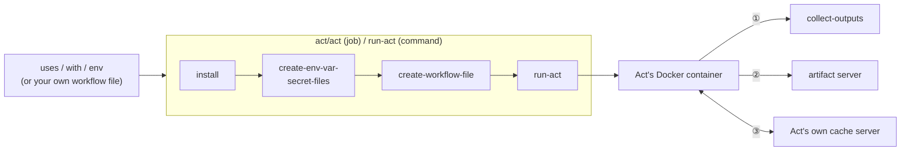

# Act Orb (Unofficial) [](https://circleci.com/gh/CircleCI-Labs/act-orb) [](https://circleci.com/developer/orbs/orb/cci-labs/act) [](https://raw.githubusercontent.com/CircleCI-Labs/act-orb/master/LICENSE) [](https://discuss.circleci.com/c/ecosystem/orbs)

The Act Orb runs a real GitHub Action inside a CircleCI job, using the open-source [Act
CLI](https://nektosact.com/) so `uses:`/`with:`/`env:` behave exactly as they would on GitHub --
plus caching (including a real `actions/cache@v4` backend, via Act's own built-in cache server)
and artifacts. See the capability table below for the full surface, or jump straight to the Quick
Start.

This orb would not be possible without the contributors who have worked on the [Act
CLI](https://nektosact.com/).

---
**Disclaimer:**

CircleCI Labs, including this repo, is a collection of solutions developed by members of CircleCI's field engineering teams through our engagement with various customer needs.

-   ✅ Created by engineers @ CircleCI
-   ✅ Used by real CircleCI customers
-   ❌ **not** officially supported by CircleCI support

---

## Quick Start

```yaml
version: 2.1
orbs:
  act: circleci/act@x.y.z
workflows:
  main:
    jobs:
      - act/act:
          name: "Hello World Javascript Action"
          uses: actions/hello-world-javascript-action@v1.1
          with: |
            who-to-greet: "Mona the Octocat"
          env: |
            hello-world: "example-value"
```

That's it for the common case -- `act/act` is a full job (checkout, install Act, generate a
one-step workflow file from `uses`/`with`/`env`, run it, cache what's cacheable). Use the `act/act`
**command** instead of the job if you need to run it inside your own executor/job (see
[Examples](#examples)).

## Capabilities

Everything below the surface area a `uses:`/`with:`/`env:` call touches -- what handles it, and
where to read the detail.

| Capability | Command(s) | Detail |
|---|---|---|
| Run one GitHub Action as a step | `act` (job or command) | [Quick Start](#quick-start) above |
| Cache the Act CLI, its actions dir, and platform images | `cache-cli` / `cache-actions` / `cache-images` | [Caching](#caching) |
| A real `actions/cache@v4` backend, via Act's own built-in cache server | `cache-server-*` params on `act`/`run-act` | [Caching](#caching) |
| `actions/upload-artifact`/`download-artifact@v4` | `artifact-server-path` param on `act`/`run-act` | [Artifacts](#artifacts) |
| Surface an action's own outputs to later native steps | `outputs` param on `act`/`run-act` | [Capturing action outputs](#capturing-action-outputs) |
| Pass a GitHub `services:` block straight through | `services` param on `act`/`run-act` | [Service containers](#service-containers) |

A whole-workflow compiler and an OIDC-token issuance shim were both built in earlier passes and
are deferred to the `feature/translation-layer` branch for this orb's first public release --
see [`docs/ROADMAP.md`](docs/ROADMAP.md) items 4 and 9 for why and what's there.

## Table of contents

- [Scope: one action per job/command invocation](#scope-one-action-per-jobcommand-invocation)
- [How it fits together](#how-it-fits-together) -- the high-level mental model
- [Mapping GitHub Actions to CircleCI](#mapping-github-actions-to-circleci) -- the concept-by-concept translation, with the *why*
- [Defaults that deviate from Act](#defaults-that-deviate-from-act)
- [Caching](#caching)
- [Artifacts](#artifacts)
- [Capturing action outputs](#capturing-action-outputs)
- [Service containers](#service-containers)
- [Security notes](#security-notes)
- [Command and job reference](#command-and-job-reference) -- every command/job, every parameter, and when to reach for the granular commands
- [What does not work](#what-does-not-work) -- the honest limits, including platform-level gaps no orb can shim around
- [Legal / compliance](#legal--compliance)
- [Resources](#resources)
- [Examples](#examples)
- [How to Contribute](#how-to-contribute)
- [How to Publish An Update](#how-to-publish-an-update)

## Scope: one action per job/command invocation

This orb (like its ecosystem-bridge siblings -- Bitrise, Harness, Bitbucket Pipes, Buildkite)
generates **one job, one step, one action** per `act/act`/`act/run-act` call, by design. It is
not a general GitHub Actions workflow executor for that call: give it a `uses`/`with`/`env`
triple (or your own hand-written workflow file) and it runs exactly that. If you need a
multi-step workflow in one job, hand-write the workflow file and pass it via
`skip-create-workflow-file: true` (see [Examples](#examples)).

A larger-scoped escape hatch -- compiling a whole, real, multi-job `.github/workflows/*.yml` file
into a wired-together, multi-job CircleCI config -- was built in an earlier pass and is currently
deferred to the `feature/translation-layer` branch rather than shipped in this orb's first public
version; see [`docs/ROADMAP.md`](docs/ROADMAP.md) item 9 for why.

## How it fits together

This is the mental model, not the full implementation -- enough to know what generates what and
which CircleCI primitive stands in for which GitHub Actions one. Every arrow below is real, traced
against the commands in `src/commands/`, not aspirational.

Every `act/act`/`act/run-act` call goes through this same sequence:



1. `steps.*.outputs.*`, only when `outputs` is set -- resolved inside the container, handed off to
   `collect-outputs`, which exports it into `$BASH_ENV` for a later native CircleCI step.
2. `actions/upload-artifact@v4`, only when `artifact-server-path` is set -- Act's own built-in
   artifact-v4 server; a native `store_artifacts`/`persist_to_workspace` step reads its output.
3. `actions/cache@v4` (and any `setup-*` action with built-in caching), when `cache-server-enabled`
   is true (the default) -- Act's own built-in cache server; this orb persists its storage
   directory across jobs via native `restore_cache`/`save_cache`. See [Caching](#caching).

Reading it:

- **`create-env-var-secret-files` is the seam a differently-named `github-token` source variable
  rides for free.** It snapshots the *entire* job environment (`env -0`) into the files Act reads
  from -- so anything an earlier step in the same job exported into `$BASH_ENV` reaches Act and the
  wrapped action automatically, with zero call-site wiring.
- **Caching (`cache-cli`/`cache-actions`/`cache-images`/`cache-server-*`) is orthogonal to the
  diagram above** -- it speeds up "install Act" and repeat `actions/cache`/`setup-*` calls, but
  doesn't change what gets generated or how it executes, so it's folded into box ③ rather than
  drawn as its own separate flow; see [Caching](#caching) for the full picture.

## Mapping GitHub Actions to CircleCI

A concept-by-concept translation, with the reasoning behind each mapping -- not just a name-to-name
table. If you already think in GitHub Actions, this is the fastest way to start thinking in
CircleCI without re-deriving it construct by construct.

| GitHub Actions concept | CircleCI concept | Why this mapping, not a different one |
|---|---|---|
| **Job** | **Job** | A like-for-like unit of one machine/container running a sequence of steps to completion. |
| **Step** | **Step** | Also a direct, like-for-like mapping -- a step is a step. The interesting translation isn't the container concept, it's what a *specific kind* of step (`uses:`) becomes; see the next row. |
| **`uses:` (an action)** | **One `act/act` invocation, wrapping one `run:` step** | GitHub's own runner has native, first-class support for "resolve and execute this action." CircleCI's `run:` step is a shell command -- there's no native "run a GitHub Action" primitive to map onto, so this orb builds one: it generates a one-step GitHub workflow file naming just that action, then runs it for real, inside Act's own container, via a `run:` step that invokes the `act` CLI. The action's own logic is never reimplemented or approximated -- Act executes the real, unmodified action, in its own real (or emulated) runtime; this orb's job stops at getting Act invoked correctly. |
| **`GITHUB_OUTPUT`** (the file an action or `run:` step writes `key=value` lines to) | **`$BASH_ENV`** | GitHub's runner watches a well-known file path and threads its contents into `steps.<id>.outputs.*` for the rest of the *workflow run* to reference via expressions. CircleCI has no equivalent expression-evaluation layer over step outputs -- `$BASH_ENV` is CircleCI's own mechanism for "a value computed in one step should be visible as a shell variable in later steps of the *same job*." This orb's `outputs`/`collect-outputs` bridges the two: it lets Act's own expression evaluation (`${{ steps.<id>.outputs.<key> }}`) resolve the value inside the container, writes it to a handoff file, then a later step exports it into `$BASH_ENV` for the rest of the CircleCI job. See [Capturing action outputs](#capturing-action-outputs) for the full mechanism and its two documented failure modes. |
| **`actions/cache@v4`** | Native `restore_cache`/`save_cache` wrapped around **Act's own built-in cache server** | Act already ships a complete, working implementation of GitHub's real cache-service protocol (`pkg/artifactcache`) -- this orb only had to expose the flags that let it point that server at a stable, known path, then persist that path across jobs the ordinary CircleCI way. See [Caching](#caching). |
| **`actions/upload-artifact`/`download-artifact`** | **`store_artifacts`**, via Act's own built-in artifact server | CircleCI's artifact concept (files attached to a job, browsable after the fact) is close enough to GitHub's that no protocol bridge was needed here -- Act already ships a complete, working implementation of GitHub's real artifact-v4 protocol; this orb only had to expose the flag that turns it on and point a native `store_artifacts` step at the same directory. See [Artifacts](#artifacts). |

A whole-workflow compiler (mapping `needs:`/`strategy.matrix`/`runs-on:` concepts) and an OIDC
bridge (`core.getIDToken()`) were both built in earlier passes and are currently deferred to the
`feature/translation-layer` branch -- see [`docs/ROADMAP.md`](docs/ROADMAP.md) items 4 and 9.

## Defaults that deviate from Act

This orb intentionally overrides six of Act's own CLI defaults, tuned for CircleCI's
fresh-VM/container-per-job model rather than Act's own local-developer-loop assumptions. All six
are `additional-act-flags`-overridable and every one is a real, current default -- not a defect --
but they were previously undocumented, so a user reading only Act's own docs would be surprised:

| Flag | Act's own CLI default | This orb's default | Why |
|---|---|---|---|
| `--pull` | `true` | `false` | Avoid re-pulling the platform image on every single job when it was likely already pulled/cached this run. |
| `--rebuild` | `true` | `false` | Same reasoning as `--pull`. |
| `--reuse` | `false` | `true` | Keep container state across the (single) job invocation. |
| `--bind` | `false` | `true` | Share the checkout directory bidirectionally with Act's container rather than copying it -- also required for the `outputs` feature below. |
| `--detect-event` | `false` | `true` | The generated workflow always has exactly one event; auto-detecting it avoids an extra required parameter. |
| `--action-offline-mode` | `false` | `true` | Paired with this orb's own actions cache (`cache-actions`), which is expected to already hold what a prior run fetched. |

Override any of these via the matching orb parameter (`pull`, `rebuild`, `reuse`, `bind`,
`detect-event`, `action-offline-mode`) if your workflow needs Act's own default instead.

This table describes the `act`/`jobs/act` entry points, which pass all six explicitly. If you call
the lower-level `act/run-act` **command** directly (see the Quick Start note above on when to use
it), `pull` and `rebuild` fall back to Act's own default (`true`) rather than this table's `false`
when you don't set them -- `run-act` is a published command in its own right, so its standalone
default is kept stable rather than silently changed underneath any existing direct caller.

## Caching

This orb caches three independent things, each on and off separately, because each is a genuinely
different artifact with a different cost/benefit tradeoff:

| Dimension | Parameter | Default | What's cached | Cache key |
|---|---|---|---|---|
| The `act` CLI binary itself | `cache-cli` | on | `<bin-dir>/act` | arch + resolved Act version (`"latest"` is resolved to a concrete tag via the GitHub API before being used as a key, so a `"latest"` pin still gets fresh cache hits/misses as new versions ship, rather than sticking to whatever "latest" meant on the first run) |
| Act's downloaded-actions directory | `cache-actions` | on | `~/.cache/act` (the actions/dependencies Act itself fetched) | arch + `cache-key-prefix` + CircleCI project ID + job name |
| The platform Docker image | `cache-images` | **off** | a `docker save`'d tar of the platform image (see `platform`) | arch + `platform` + `cache-key-prefix` |
| Act's own GitHub Actions cache-server storage | `cache-server-enabled` | on | `cache-server-path` (default `~/.cache/actcache`) -- everything a wrapped `actions/cache@v4`/`setup-*` call saved | arch + `cache-key-prefix` + CircleCI project ID + job name |

`cache-images` defaults to off because Docker image tars are large relative to the other
artifacts and remote-docker/executor image pulls are often already fast on CircleCI's own image
cache -- turn it on if your platform image is unusually large or slow to pull in your environment.

All four cache keys share the `cache-key-prefix` parameter (default `v1`) as a common prefix, so
bumping it busts every cache dimension at once if you ever need a clean slate across all of them.

**Upgrade note:** the `cache-actions` key format changed in this release (a stray double dash
before `{{ .Environment.CIRCLE_JOB }}` was fixed to a single dash). Cache keys are literal
strings, not patterns, so this is a one-time, self-healing change: your existing actions cache
under the old key becomes unreachable, `restore_cache` falls through to the unversioned prefix key
(or a cold cache on the very next run), and a fresh cache is saved under the corrected key from
then on. Nothing breaks -- expect one slower "Restoring cache for Act's Actions..." step after
upgrading, not a caching regression.

## Actions cache (a real `actions/cache@v4` backend, via Act's own cache server)

A real `actions/cache@v4` call (or any `setup-*` action with built-in caching) inside a wrapped
action needs a real cache-service backend, or it silently gets Act's own ephemeral,
dies-with-the-container cache instead. **Act already ships its own built-in GitHub Actions cache
server** (`pkg/artifactcache`, on by default since Act v0.2.45) -- a real, unmodified
`actions/cache@v4` talks to it with zero orb-side protocol translation, verified end to end in
this orb's own CI (`test_act_cache_server_durable_hit_save`/`_restore` in
`.circleci/test-deploy.yml`).

What this orb adds is *persistence*: Act's cache server is ephemeral to one job's container, so
without help its storage dies with the VM exactly like Act's own actions/image caches would.
`cache-server-enabled` (on by default) tells Act where its storage lives
(`cache-server-path`, default `~/.cache/actcache`) and wraps that directory in native
`restore_cache`/`save_cache` calls, the same pattern this orb already uses for
`cache-actions`/`cache-images` -- see [Caching](#caching) above.

```yaml
- act/act:
    uses: actions/cache/save@v4
    with: |
      path: node_modules
      key: my-cache-key-v1
- act/act:
    uses: actions/cache/restore@v4
    with: |
      path: node_modules
      key: my-cache-key-v1
```

No extra step is needed before `act/act` -- unlike the shim this replaced, there is no separate
server to start; `cache-server-enabled`'s default (`true`) is all the wiring required.

**The one honest tradeoff:** the cache key this orb saves under covers `cache-server-path` as a
whole directory, not one key per `actions/cache` entry. A change that, on real GitHub Actions,
would invalidate only one specific `actions/cache` key still causes *every* `actions/cache`
entry saved under this job's cache-server storage to be re-saved together the next time this
job runs. If your workflow saves several logically distinct caches in one job and only one of
them should ever be busted independently, that granularity is not available here -- the
directory-level key is the unit of invalidation.

**What happens if the cache server isn't reachable at all** (e.g. `cache-server-enabled: false`,
which passes `--no-cache-server`): `actions/cache`'s own client (`actions/toolkit`) treats a save
or restore failure as a **warning, not a build failure** -- the step logs it and the job
continues cold, exactly as if nothing had been cached. Verified directly against
`actions/toolkit`'s own source, not assumed.

**Set `cache-server-addr` explicitly if the default auto-detection picks the wrong interface.**
Act auto-detects an outbound IP to advertise to the wrapped action's container. On a real
CircleCI `machine` executor (a real local Docker daemon, the same topology this orb already
recommends for anything needing `--bind` -- see [Defaults that deviate from
Act](#defaults-that-deviate-from-act)) this is expected to work and is exercised for real in this
orb's own CI. On a machine with multiple or unusual network interfaces (observed: a developer
laptop with an active VPN adapter), auto-detection can pick the wrong one; set
`cache-server-addr` explicitly (and consider `--network host` via `additional-act-flags`) if a
cache step silently misses when you'd expect a hit.

## Artifacts

`actions/upload-artifact`/`download-artifact@v4` now work for jobs that don't use `container:` --
via a much smaller change than a from-scratch shim would have been. Investigating this surfaced
that **Act already ships a complete, working implementation of GitHub's real artifact-v4
protocol** (`pkg/artifacts` in `nektos/act`'s own source: the exact Twirp
`ArtifactService.{CreateArtifact,UploadArtifact,FinalizeArtifact,ListArtifacts,
GetSignedArtifactURL,DownloadArtifact}` routes, storing to local disk) -- it just never starts
that server unless you pass `--artifact-server-path`, a flag this orb never exposed. `run-act`
now has `artifact-server-path`/`artifact-server-addr`/`artifact-server-port` parameters (all
empty/off by default -- zero behavior change unless you set them) that pass straight through to
Act's own CLI flags of the same name. Once Act's runner sees `ArtifactServerPath != ""`, it
automatically injects `ACTIONS_RUNTIME_URL`/`ACTIONS_RESULTS_URL`/`ACTIONS_RUNTIME_TOKEN` into the
wrapped action's container itself (verified directly in `pkg/runner/run_context.go`) -- no orb
wiring needed beyond the one flag.

```yaml
- act/act:
    uses: actions/upload-artifact@v4
    with: |
      name: my-artifact
      path: some-file.txt
    artifact-server-path: /tmp/act-artifacts
- store_artifacts:
    path: /tmp/act-artifacts
    destination: gha-artifacts
```

This is real, tested in this orb's own CI (`test_artifacts` in `.circleci/test-deploy.yml`) end to
end: the file really lands on the CircleCI host's disk at the configured path, handed to a native
`store_artifacts` step. It does **not** fix `upload-artifact@v4` failing outright inside
`container:`-scoped jobs ([nektos/act#2508](https://github.com/nektos/act/issues/2508), open,
because the job's container image has no Node in it) -- that is an upstream Act limitation no
orb-side flag can work around, exactly as anticipated when this was originally scoped as deferred
(see `docs/ROADMAP.md` item 2).

## Capturing action outputs

Set `outputs` to a comma-separated list of the wrapped action's own output keys (matching its
`action.yml` `outputs:` block) to have this orb export them, verbatim by name, into `$BASH_ENV`
for a later, native CircleCI step in the same job to read as a plain shell variable:

```yaml
- act/act:
    uses: actions/hello-world-javascript-action@v1.1
    with: |
      who-to-greet: "Mona the Octocat"
    outputs: "time"
- run: echo "Greeted at $time"
```

This is opt-in and defaults to off (`outputs: ""`) -- existing jobs that don't set it see no
behavior change at all. It works by giving the generated action step a stable `id:` and appending
a second, same-job step that resolves each `${{ steps.<id>.outputs.<key> }}` expression and writes
it to a handoff file inside the (bound) checkout directory, which a `collect-outputs` step then
reads back on the CircleCI host. It does **not** read Act's `$GITHUB_OUTPUT` file directly --
that file lives inside Act's own per-step temp area, which is not shared with the CircleCI host
even with `bind` enabled, so `steps.*.outputs` expression evaluation (which Act supports natively)
is the mechanism that actually works. This means `outputs` only works when this orb is generating
the workflow file (`skip-create-workflow-file` unset) and `bind` stays enabled (the default). If
you bring your own workflow file, you can still reach `$BASH_ENV` yourself using the same pattern
this orb generates.

Violating either requirement does not error -- it fails silently, so know the actual behavior:

- **`bind: false` with `outputs` set:** the container's handoff-file write never reaches the
  CircleCI host, so `collect-outputs` finds nothing and no-ops. This orb logs a warning to that
  effect; no output is exported and no later step's use of the variable will resolve.
- **`skip-create-workflow-file: true` with `outputs` set:** nothing generates the output-capture
  step in your hand-written workflow, so Act never (re)writes the handoff file on this call. Every
  `act/act`/`run-act` invocation that requests `outputs` removes any handoff file left over from
  an *earlier* call in the same job/`directory` before it runs, specifically so this case can never
  silently re-export a previous call's stale value -- but it still cannot produce a *fresh* value
  from a workflow file that doesn't write one, since Act's own `$GITHUB_OUTPUT` per-step temp area
  isn't shared with the host even with `bind` on. Add the same "collect outputs for CircleCI" step
  this orb generates (see the source of `create-workflow-file.sh`) to your own workflow file if you
  need `outputs` alongside `skip-create-workflow-file`.

Output keys containing characters that aren't legal in a shell variable name (GitHub allows `-` in
output ids; bash does not) are exported under a sanitized name (dashes -> underscores) with a
loud warning in the step's log -- the action's own output name is unaffected, only the
CircleCI-side variable name differs.

## Service containers

Pass a GitHub Actions `services:` block straight through via the `services` parameter:

```yaml
- act/act:
    uses: actions/hello-world-javascript-action@v1.1
    services: |
      postgres:
        image: postgres:16
        env:
          POSTGRES_PASSWORD: postgres
        ports:
          - 5432:5432
```

This is a **verbatim passthrough** into the generated workflow file -- Act emulates `services:`
itself via its own Docker networking, which inherits Act's own known service-emulation issues
([nektos/act#1022](https://github.com/nektos/act/issues/1022),
[nektos/act#2607](https://github.com/nektos/act/issues/2607), both open at the time of writing).
A native translation to a CircleCI secondary Docker image (CircleCI's own equivalent primitive,
no Act emulation needed) is a larger, job-level design change -- see `docs/ROADMAP.md`.

## Security notes

**`with`/`env`/`services` are trusted, unescaped input.** This orb builds the generated workflow
file by embedding these parameters' raw string values directly into generated YAML (indented to
fit, but not otherwise escaped). This matches how `config.yml` itself already trusts a job's own
parameter values, but it's worth stating plainly now that `services` extends the same pattern to
a third parameter: if any of `with`/`env`/`services` are ever populated from a source you don't
control (e.g. a CircleCI pipeline parameter fed by a webhook payload or a PR title), a crafted
value could break out of its intended YAML block and inject arbitrary keys/steps into the
generated workflow. Treat these the same as any other config-author-trusted value -- don't wire
untrusted external input into them directly.

**`GITHUB_TOKEN` is a weaker substitute, not a drop-in one.** Real GitHub Actions' `GITHUB_TOKEN`
is a per-job GitHub App installation token, auto-scoped to exactly one repository and
auto-expiring when the job ends. There is no CircleCI primitive that mints anything like it. This
orb (and its `avoid_token_error` example) can only wire in a personal access token you create and
store as a CircleCI project/context env var -- which is broader in scope than the job needs, does
not auto-expire, is not automatically narrowed by a workflow's own `permissions:` block, and must
be rotated by you. Scope it to the minimum you actually need and rotate it on a schedule.

**The `github-token` parameter is a seam, not a mint.** By default it names `GITHUB_TOKEN` --
identical behavior to today. Point it at a *different* CircleCI env var name (e.g. one populated by
a future pipeline-scoped token-minting step) and this orb aliases that variable's value into the
secrets bucket under the literal key `GITHUB_TOKEN` for you, and keeps the source variable's own
name out of the plaintext `.env` file automatically -- so Act and the wrapped Action still see a
plain `GITHUB_TOKEN`, with zero interface change on either side. This orb implements only the
aliasing; it mints nothing itself. CircleCI's Sources of Change team already mints scoped GitHub
App installation tokens tied to pipeline-trigger time (`TokenRestrictions{Scopes, RepositoryIDs}`,
`CreateAndStoreTokenForPipeline` in `soc-integrations`) -- the only missing piece to get much
closer to real GitHub Actions' own per-job token behavior is exposing one of those into a job's
environment under some other env var name and pointing `github-token` at it. See
`docs/ROADMAP.md` for the fuller rationale.

**The env/secret/var files this orb generates for Act are opt-in secret, not opt-out.** By
default only `GITHUB_TOKEN` is treated as sensitive (the `secrets` parameter); every other
environment variable present in the job is written to the **plaintext** `.env` file Act reads
from, unless you explicitly list it in `secrets` or `variables`. Review what your job's
environment actually contains before running this orb, especially in a context with broad env
access. Multi-line values (SSH keys, JSON service-account credentials) are handled without
leaking fragments into the plaintext file even when correctly named as a secret, but are still
written unquoted -- Act's own dotenv-style parser may not round-trip an embedded newline
correctly; avoid multi-line secrets/vars, or pre-encode them (e.g. base64), if you must use one.

**Act's own installer script is fetched from a pinned commit and checksum-verified before it's
ever executed** (rather than piping a mutable branch ref straight into `sudo bash`) -- see the
comment block at the top of `src/scripts/install.sh` for the maintenance process if Act changes
that script upstream. The release *binary* Act's installer downloads is checksum-verified by
Act's own installer already; this orb doesn't duplicate that, only the installer-script fetch
itself.

## Command and job reference

Every command and job this orb ships, one line each. "Calls" means the aggregate composes that
command internally with no extra wiring at your call site -- see [Reach for the granular
commands instead](#reach-for-the-granular-commands-instead-of-act-when) below for when to call
one of these directly instead of the aggregate.

| Name | Kind | What it does |
|---|---|---|
| `act` | command, job | The aggregate most users want (see [Quick Start](#quick-start)): checkout -> install -> create-env-var-secret-files -> create-workflow-file -> run-act, in order. The job also picks the executor; the command runs inside whatever job/executor you already have. |
| `install` | command | Resolves and installs the Act CLI. Calls `restore-cli`/`cache-cli` itself when `cache-cli` is true (the default). |
| `restore-cli` | command | Restores the cached Act binary (arch + resolved version key -- `"latest"` is resolved to a concrete tag first, see [Caching](#caching)). |
| `cache-cli` | command | Saves the Act binary to cache after a successful install. |
| `create-env-var-secret-files` | command | Snapshots the job's entire environment (`env -0`) into `.env`/`.secrets`/`.vars`, splitting by the `secrets`/`variables` allow-lists and the `github-token` seam. |
| `create-workflow-file` | command | Generates a one-action GitHub workflow YAML file from `uses`/`with`/`env`/`services`/`outputs`. Skipped entirely when you supply your own workflow file (`skip-create-workflow-file: true`). Its own parameter is named `action`, not `uses` -- `act`/`act` (job/command) map `uses` onto it for you. |
| `run-act` | command | Restores/saves the actions, Docker-image, and Act-cache-server caches (`restore-actions`/`restore-image`/`restore-actcache` before, `cache-actions`/`cache-image`/`cache-actcache` after) around the actual `act` CLI invocation, then runs `collect-outputs` if `outputs` is set. The lowest-level command that actually invokes `act` -- see the Quick Start's note on when to call this instead of `act`. |
| `restore-actions` | command | Restores Act's downloaded-actions cache (`~/.cache/act`). |
| `cache-actions` | command | Saves Act's downloaded-actions cache after a run. |
| `restore-image` | command | Restores a cached, `docker save`'d platform image tar (only meaningful with `cache-images: true`). |
| `cache-image` | command | Saves the platform image tar to cache after a run (only meaningful with `cache-images: true`). |
| `restore-actcache` | command | Restores Act's own built-in GitHub Actions cache-server storage directory (only meaningful with `cache-server-enabled: true`, the default) -- see [Caching](#caching). |
| `cache-actcache` | command | Saves Act's own cache-server storage directory after a run (only meaningful with `cache-server-enabled: true`). |
| `collect-outputs` | command | Reads the action-output handoff file `run-act` produced and exports each value, verbatim by key name, into `$BASH_ENV`. Safe to call even if nothing was produced -- see [Capturing action outputs](#capturing-action-outputs). |

### `act` (command and job) parameters

The full parameter surface -- every one of these is also exposed, under the same name, on the
granular commands that actually consume it (`install`, `create-env-var-secret-files`,
`create-workflow-file`, `run-act`); see each command's own description on the [Orb Registry
page](https://circleci.com/developer/orbs/orb/cci-labs/act) for the always-current, exhaustive
list if this table and that page ever drift.

| Parameter | Type | Default | What it does |
|---|---|---|---|
| `executor` *(job only)* | executor | `default` | Which executor runs Act -- see [Defaults that deviate from Act](#defaults-that-deviate-from-act) for why `machine`, not `docker`, is this orb's own default shape. |
| `checkout` | boolean | `true` | Check out the project first. |
| `uses` | string | `""` | The action to run (e.g. `actions/checkout@v2`). Alias of `id`; `uses` wins if both are set. |
| `id` | string | `""` | Family-consistent alias of `uses` (matches the sibling ecosystem-bridge orbs' vocabulary). |
| `with` | string | `""` | Key-value `with:` block for the action. Alias of `inputs`; `with` wins if both are set. |
| `inputs` | string | `""` | Family-consistent alias of `with`. |
| `env` | string | `""` | Key-value `env:` block for the action's step. |
| `services` | string | `""` | Verbatim `services:` block, passed straight through to Act with no translation -- see [Service containers](#service-containers). |
| `outputs` | string | `""` | Comma-separated action output keys to surface into `$BASH_ENV` -- see [Capturing action outputs](#capturing-action-outputs). Empty (default): zero behavior change. |
| `outputs-file` | string | `.act-orb-outputs.env` | Handoff filename (relative to checkout root) used to carry outputs out of Act's container. |
| `workflow-file` | string | `/tmp/workflow.yml` | Where the generated (or your own) workflow file lives. |
| `skip-create-workflow-file` | boolean | `false` | Skip generation -- use your own workflow file at `workflow-file` instead (see [`passing_workflow_file.yml`](src/examples/passing_workflow_file.yml)). |
| `workflow-name` / `workflow-event` / `job-name` / `runs-on-image` | string | `circleci` / `push` / `action` / `ubuntu-latest` | Cosmetic fields of the generated one-job workflow file. |
| `platform` | string | `ubuntu-latest=catthehacker/ubuntu:act-latest` | Act's `--platform` mapping (`runs-on:` value=image). |
| `github-token` | env_var_name | `GITHUB_TOKEN` | Which CircleCI env var names the GitHub token Act/the action should see -- a seam, not a mint; see [Security notes](#security-notes). |
| `secrets` | string | `GITHUB_TOKEN` | Comma-separated env vars written to the secrets bucket, not the plaintext `.env` file. |
| `variables` | string | `""` | Comma-separated env vars exposed to the action as `${{ vars.* }}`. |
| `env-file` / `secret-file` / `var-file` / `event-file` / `input-file` | string | `/tmp/act.env` / `/tmp/act.secrets` / `/tmp/act.vars` / `/tmp/act.event` / `.input` | Paths to the generated env/secret/var/event/input files Act reads. |
| `actor` | string | `nektos/act` | User that triggered the simulated event. |
| `bind` | boolean | `true` | Bind-mount (not copy) the working directory into Act's container. **Deviates from Act's own default (`false`)** -- see [Defaults that deviate from Act](#defaults-that-deviate-from-act). Required for `outputs`. |
| `verbose` | boolean | `false` | Detailed Act logging. |
| `detect-event` | boolean | `true` | Auto-detect the workflow's event type. **Deviates from Act's own default (`false`).** |
| `directory` | string | `.` | Working directory for the workflow. |
| `action-offline-mode` | boolean | `true` | Run without fetching actions from remote sources (pairs with `cache-actions`). **Deviates from Act's own default (`false`).** |
| `defaultbranch` | string | `main` | Default branch Act assumes. |
| `job` | string | `""` | Run only this job ID from the workflow file. |
| `pull` | boolean | `false` (`true` on `run-act` standalone) | Force-pull Docker images. **Deviates from Act's own default (`true`)** at the `act`/job layer only -- see the table in [Defaults that deviate from Act](#defaults-that-deviate-from-act). |
| `rebuild` | boolean | `false` (`true` on `run-act` standalone) | Rebuild local Docker images. Same deviation pattern as `pull`. |
| `remote-name` | string | `origin` | Git remote name used to resolve the repo URL. |
| `reuse` | boolean | `true` | Don't remove the container after a successful run. **Deviates from Act's own default (`false`).** |
| `additional-act-flags` | string | `""` | Extra flags passed verbatim to the `act` CLI (word-split, unlike every other parameter here). |
| `artifact-server-path` / `artifact-server-addr` / `artifact-server-port` | string | `""` / `""` / `""` | Turn on and configure Act's own built-in artifact-v4 server -- see [Artifacts](#artifacts). Empty is a no-op. |
| `cache-server-enabled` | boolean | `true` | Persist Act's own built-in GitHub Actions cache server storage across jobs (`true`, the default), or disable Act's cache server entirely with `--no-cache-server` (`false`) -- see [Caching](#caching). |
| `cache-server-path` / `cache-server-addr` / `cache-server-port` | string | `~/.cache/actcache` / `""` / `""` | Configure Act's own built-in cache server -- see [Caching](#caching). Only meaningful when `cache-server-enabled` is true. |
| `cache-cli` / `cache-actions` / `cache-images` | boolean | `true` / `true` / `false` | Per-dimension cache toggles -- see [Caching](#caching). |
| `cache-key-prefix` | string | `v1` | Common prefix across all cache-key dimensions. |
| `force-install` | boolean | `false` | Reinstall Act even if a cached/existing binary is present. |
| `version` | string | `latest` | Act CLI version to install. |
| `debug` | boolean | `false` | Debug logging for the install step itself. |
| `bin-dir` | string | `/home/circleci/bin` | Where the Act binary is installed. |
| `skip-install` | boolean | `false` | Skip installing Act entirely (assume it's already on `PATH`). |
| `skip-create-env-var-secret-files` | boolean | `false` | Skip generating the env/secret/var files. |
| `step-name` *(command only)* | string | `Run Act` | Name of the step that actually invokes `act`. Not exposed on the `act` job. |

### Reach for the granular commands instead of `act` when...

- **You're chaining multiple actions in one job.** Each layer reads/writes plain files with no
  shared state to skip -- give each `run-act` call its own `workflow-file`/`env-file`, and call
  `install` once, then `create-env-var-secret-files` -> `create-workflow-file` -> `run-act` again
  per action.
- **You already have a rendered workflow file** (e.g. [`passing_workflow_file.yml`](src/examples/passing_workflow_file.yml)):
  skip straight to `run-act` with `workflow-file` pointed at it and `skip-create-workflow-file`
  irrelevant, since you never call `create-workflow-file` at all.
- **You want native steps interleaved between stages** -- e.g. inspecting the generated
  `.env`/`.secrets` files between `create-env-var-secret-files` and `run-act`.

### Worked example: composing the granular commands by hand

```yaml
version: 2.1
orbs:
  act: circleci/act@x.y.z
jobs:
  two_actions_one_job:
    docker:
      - image: cimg/base:current
    steps:
      - checkout
      - setup_remote_docker
      - act/install
      - act/create-env-var-secret-files
      - act/create-workflow-file:
          workflow-file: /tmp/first.yml
          action: actions/hello-world-javascript-action@v1.1
          with: |
            who-to-greet: "Mona the Octocat"
      - act/run-act:
          workflow-file: /tmp/first.yml
      - act/create-workflow-file:
          workflow-file: /tmp/second.yml
          action: actions/setup-node@v4
          with: |
            node-version: "20"
      - act/run-act:
          workflow-file: /tmp/second.yml
      - run: echo "both actions ran in one job, sharing one Act install/cache"
workflows:
  main:
    jobs:
      - two_actions_one_job
```

## What does not work

- **`actions/upload-artifact`/`download-artifact` now work for non-`container:`-scoped jobs** --
  see [Artifacts](#artifacts) below: Act already ships a complete artifact-v4 server, this orb
  just now exposes the one flag (`artifact-server-path`) that turns it on. `upload-artifact@v4`
  still fails outright inside `container:`-scoped jobs
  ([nektos/act#2508](https://github.com/nektos/act/issues/2508), open) because the job's
  container image has no Node in it -- on real GitHub Actions this step runs at the runner level,
  outside the job container, specifically to avoid that; no shim can patch around an upstream Act
  limitation. See `docs/ROADMAP.md` item 2.
- **No OIDC token issuance.** Act does not implement GitHub's OIDC signer
  ([nektos/act#2500](https://github.com/nektos/act/issues/2500),
  [nektos/act#2262](https://github.com/nektos/act/issues/2262), both open); an action calling
  `core.getIDToken()` will error unless you pre-populate a fake value yourself. A working shim
  for this exists on the `feature/translation-layer` branch, deferred rather than shipped in
  this orb's first public version -- see `docs/ROADMAP.md` item 4.
- **Non-Linux `runs-on` targets aren't really emulated.** `runs-on: macos-*`/`windows-*` either
  silently runs on the wrong platform image or fails -- a long-standing Act limitation
  ([nektos/act#97](https://github.com/nektos/act/issues/97), open since 2020), not something this
  orb can fix.
- **Reusable workflows (`workflow_call`) are poorly supported by Act itself** -- matrix +
  reusable-workflow combinations, nested `if:` conditions, and related issues have several
  long-standing open reports upstream
  ([nektos/act#1114](https://github.com/nektos/act/issues/1114),
  [nektos/act#2003](https://github.com/nektos/act/issues/2003)).
- **GitHub-native security-tab integrations have no destination.** `github/codeql-action` and any
  action whose entire purpose is uploading into GitHub's own Code Scanning/Dependabot/Secret
  Scanning UI cannot work off-GitHub -- there is no equivalent surface to upload into, full stop.

See [Scope](#scope-one-action-per-jobcommand-invocation) above for the one-action-per-call
boundary itself -- not repeated here since it isn't a limitation so much as this orb's own
design boundary. A larger-scoped, whole-workflow compiler that lifts this boundary was built in
an earlier pass and is currently deferred to the `feature/translation-layer` branch; see
`docs/ROADMAP.md` item 9.

## Legal / compliance

This orb implements action execution purely by installing and shelling out to
[nektos/act](https://github.com/nektos/act)'s own MIT-licensed CLI locally -- it does not read,
copy, or fork that CLI's source, and it never contacts GitHub's own backend (no account, no API
token, no workflow-run identity). The installer script itself is fetched from a pinned commit and
checksum-verified before it's ever executed (see `src/scripts/install.sh`'s header comment); the
release binary Act's own installer downloads is checksum-verified by Act's own installer already.
GitHub Actions themselves (whatever `uses:` names) are fetched and run by Act exactly as they
would be locally -- check a given action's own license/repository before relying on it in a
context where that matters, the same diligence you'd apply running `act` directly yourself.

## Resources

- [CircleCI Orb Registry Page](https://circleci.com/developer/orbs/orb/cci-labs/act) -- the official registry page of this orb for all versions, executors, commands, and jobs described.
- [CircleCI Orb Docs](https://circleci.com/docs/orb-intro/#section=configuration) -- docs for using, creating, and publishing CircleCI Orbs.

**Deep dives**, for the detail this README pushes out of the way by default:

- [`docs/ROADMAP.md`](docs/ROADMAP.md) -- larger items deliberately scoped out of past passes (or deferred to `feature/translation-layer`), with the reasoning recorded.

## Examples

For the most up to date examples, please visit the Orb Registry's [usage
examples](https://circleci.com/developer/orbs/orb/cci-labs/act#usage-examples), or the runnable
files under [`src/examples/`](src/examples/).

### Avoid GitHub Token Errors

```yaml
  version: 2.1
  orbs:
    act: circleci/act@x.y.z
  workflows:
    main:
      jobs:
        - act/act:
            uses: aquasecurity/trivy-action@master
            with: |
              scan-type: fs
              ignore-unfixed: true
              format: sarif
              output: report.sarif
              scanners: vuln,secret,misconfig,license
            platform: ubuntu-latest=ghcr.io/catthehacker/ubuntu:act-latest
            context: act

```

## How to Contribute

We welcome [issues](https://github.com/CircleCI-Labs/act-orb/issues) to and [pull requests](https://github.com/CircleCI-Labs/act-orb/pulls) against this repository!

Every script in `src/scripts/` is enforced clean by `shellcheck` (`severity: error`) and `shfmt
-i 4 -ci -sr` in CI. See [`docs/ROADMAP.md`](docs/ROADMAP.md) for larger items that were
deliberately scoped out of past passes, with the reasoning recorded rather than lost.

**CircleCI CLI version floor: `>= 1.0.48254`.** Older CLI builds silently pack this orb's
`<<include(...)>>` directives as literal text instead of expanding them, producing a broken orb
that can still pass `circleci orb validate` -- a false green with no other symptom. Run
`scripts/check-circleci-cli-version.sh` (also wired into `.circleci/config.yml`'s `lint-pack`
workflow) before packing locally if you're not sure which build you have.

**`pre-steps`/`post-steps` are reserved job-parameter names.** `circleci orb validate` rejects a
job parameter literally named `pre-steps` or `post-steps` outright -- this only surfaces under
`orb validate`, which needs a token, so a plain `circleci config validate`/pack will not catch it.
If you're adding a new job parameter, don't pick either name. (This orb has never had a
before/after-steps-style hook parameter to collide with this, but a future job parameter still
could.)

## How to Publish An Update
1. Merge pull requests with desired changes to the main branch.
    - For the best experience, squash-and-merge and use [Conventional Commit Messages](https://conventionalcommits.org/).
2. Find the current version of the orb.
    - You can run `circleci orb info cci-labs/act | grep "Latest"` to see the current version.
3. Create a [new Release](https://github.com/CircleCI-Labs/act-orb/releases/new) on GitHub.
    - Click "Choose a tag" and _create_ a new [semantically versioned](http://semver.org/) tag. (ex: v1.0.0)
      - We will have an opportunity to change this before we publish if needed after the next step.
4.  Click _"+ Auto-generate release notes"_.
    - This will create a summary of all of the merged pull requests since the previous release.
    - If you have used _[Conventional Commit Messages](https://conventionalcommits.org/)_ it will be easy to determine what types of changes were made, allowing you to ensure the correct version tag is being published.
5. Now ensure the version tag selected is semantically accurate based on the changes included.
6. Click _"Publish Release"_.
    - This will push a new tag and trigger your publishing pipeline on CircleCI.
