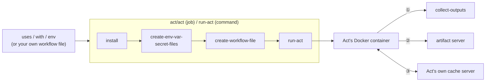

# Architecture

How this orb turns `uses`/`with`/`env` into a real, running GitHub Action, and the reasoning
behind the pieces involved.

## Scope: one action per job/command invocation

This orb (like its ecosystem-bridge siblings: Bitrise, Harness, Bitbucket Pipes, Buildkite)
generates **one job, one step, one action** per `act/act`/`act/run-act` call, by design. It is
not a general GitHub Actions workflow executor: give it a `uses`/`with`/`env` triple (or your own
hand-written workflow file) and it runs exactly that. If you need a multi-step workflow in one
job, hand-write the workflow file and pass it via `skip-create-workflow-file: true` (see the
[worked example](COMMANDS.md#worked-example-composing-the-granular-commands-by-hand)).

A larger-scoped escape hatch, compiling a whole, real, multi-job `.github/workflows/*.yml` file
into a wired-together, multi-job CircleCI config, was built in an earlier pass. It's currently
deferred to the `feature/translation-layer` branch rather than shipped in this orb's first public
version; see [`ROADMAP.md`](ROADMAP.md) item 9 for why.

## How it fits together

This is the mental model, not the full implementation: enough to know what generates what and
which CircleCI primitive stands in for which GitHub Actions one. Every arrow below is real, traced
against the commands in `src/commands/`, not aspirational.

Every `act/act`/`act/run-act` call goes through this same sequence:

1. `steps.*.outputs.*`, only when `outputs` is set. It's resolved inside the container, handed off
   to `collect-outputs`, which exports it into `$BASH_ENV` for a later native CircleCI step.
2. `actions/upload-artifact@v4`, only when `artifact-server-path` is set. This is Act's own
   built-in artifact-v4 server; a native `store_artifacts`/`persist_to_workspace` step reads its
   output.
3. `actions/cache@v4` (and any `setup-*` action with built-in caching), when
   `cache-server-enabled` is true (the default). This is Act's own built-in cache server; this
   orb persists its storage directory across jobs via native `restore_cache`/`save_cache`. See
   [Caching](CAPABILITIES.md#caching).

Reading it:

- **`create-env-var-secret-files` is the seam a differently-named `github-token` source variable
  rides for free.** It snapshots the *entire* job environment (`env -0`) into the files Act reads
  from, so anything an earlier step in the same job exported into `$BASH_ENV` reaches Act and the
  wrapped action automatically, with zero call-site wiring.
- **Caching (`cache-cli`/`cache-actions`/`cache-images`/`cache-server-*`) is orthogonal to the
  diagram above.** It speeds up "install Act" and repeat `actions/cache`/`setup-*` calls, but
  doesn't change what gets generated or how it executes, so it's folded into box ③ rather than
  drawn as its own separate flow; see [Caching](CAPABILITIES.md#caching) for the full picture.

## Defaults that deviate from Act

This orb intentionally overrides six of Act's own CLI defaults, tuned for CircleCI's
fresh-VM/container-per-job model rather than Act's own local-developer-loop assumptions. All six
are `additional-act-flags`-overridable and every one is a real, current default, not a defect. But
they were previously undocumented, so a user reading only Act's own docs would be surprised:

| Flag | Act's own CLI default | This orb's default | Why |
|---|---|---|---|
| `--pull` | `true` | `false` | Avoid re-pulling the platform image on every single job when it was likely already pulled/cached this run. |
| `--rebuild` | `true` | `false` | Same reasoning as `--pull`. |
| `--reuse` | `false` | `true` | Keep container state across the (single) job invocation. |
| `--bind` | `false` | `true` | Share the checkout directory bidirectionally with Act's container rather than copying it. Also required for the `outputs` feature; see [Capturing action outputs](CAPABILITIES.md#capturing-action-outputs). |
| `--detect-event` | `false` | `true` | The generated workflow always has exactly one event; auto-detecting it avoids an extra required parameter. |
| `--action-offline-mode` | `false` | `true` | Paired with this orb's own actions cache (`cache-actions`), which is expected to already hold what a prior run fetched. |

Override any of these via the matching orb parameter (`pull`, `rebuild`, `reuse`, `bind`,
`detect-event`, `action-offline-mode`) if your workflow needs Act's own default instead.

This table describes the `act`/`jobs/act` entry points, which pass all six explicitly. If you call
the lower-level `act/run-act` **command** directly (see the Quick Start note in the README on when
to use it), `pull` and `rebuild` fall back to Act's own default (`true`) rather than this table's
`false` when you don't set them. `run-act` is a published command in its own right, so its
standalone default is kept stable rather than silently changed underneath any existing direct
caller.

This orb's default executor is a `machine` executor (a real local Docker daemon), the topology
recommended for anything that needs `--bind` or Act's own cache server's address auto-detection to
work as expected; see [Caching](CAPABILITIES.md#caching) for the one case that needs an explicit
address instead.
